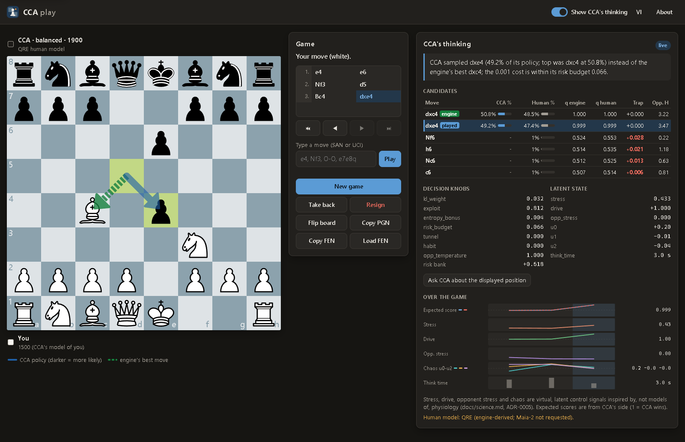

# CCA

[](https://github.com/DonQuaan/CCA/actions/workflows/ci.yml)
[](LICENSE)
[](pyproject.toml)

Tiếng Việt: [README.vi.md](README.vi.md)

**CCA** (short for *Chaotic Chess Algorithm*) is a research and learning project: a decision
layer on top of **Stockfish 19** and a **human move model** (Maia-2, or an engine-derived QRE
baseline). CCA is designed to play chess that is **human-like** and **hard to predict**, and that
**aims at the mistakes a human of the opponent's rating is likely to make** (as predicted by
Maia-2 or QRE at that rating), while every move stays within a bounded, budgeted expected-score
sacrifice of Stockfish's best move. Stockfish only *measures*; the move is chosen by CCA's own
decision core, C-AIME ([ADR-0003](docs/adr/0003-stockfish-as-perception-not-policy.md)). You can
play against it in a browser simulator that shows its decision signals live, run it as a UCI
engine in chess GUIs and lichess-bot, and study every mechanism, each documented with its formula
and its scientific status.

> **Research status (v0.2.0).** The architecture is implemented and tested. Its behavioural
> claims (human-likeness, unpredictability, trap-setting against people) are **hypotheses** with
> pre-registered kill criteria in [`docs/science.md`](docs/science.md#2-pre-registered-falsifiable-predictions);
> v0.2.0 reports no result for any of them. "Stress" and "drive" are virtual control variables
> *inspired by*, not models of, human physiology
> ([ADR-0005](docs/adr/0005-honest-science-labelling.md)). Hand-set parameters are labelled
> "not fitted".



*`cca play` (English, dark theme) after 1.e4 e6 2.Nf3 d5 3.Bc4 dxe4, against real Stockfish 19: CCA
plays Black (`balanced`, 1900, QRE human model). The blue arrow is its policy, the dashed green
arrow the engine's best move. The panel explains the choice ("CCA sampled dxe4 (49.2% of its
policy; top was dxc4 at 50.8%) instead of the engine's best dxc4; the 0.001 cost is within its risk
budget 0.066"), lists the candidates (CCA %, Human %, q engine, q human, Trap, Opp. H) and shows
the knobs, the latent state and per-move charts. Vietnamese UI, light theme:
[`docs/img/cca-play-vi-light.png`](docs/img/cca-play-vi-light.png).*

## Highlights

- **Decision model:** Stockfish 19 MultiPV + WDL gives `q_opt`, the expected score according to
  Stockfish; the agent's own human prior (Maia-2 at its rating) is the piKL anchor; a 2-ply
  look-ahead with the *opponent's* human reply distribution gives `q_human`, the trap value and
  the opponent's decision entropy. Only moves within a risk budget of the engine's best are
  eligible.
- **Browser simulator** (`cca play`): watch CCA's policy, candidates, knobs, latent state and
  charts move by move; English and Vietnamese; a fair-game mode hides them until the game ends.
- **UCI engine** (`cca-uci`, `cca uci`) with setup notes for Cute Chess, Arena, En Croissant,
  BanksiaGUI, Scid vs. PC, ChessBase and lichess-bot (Lichess BOT accounts only).
- **Container images** `ghcr.io/donquaan/cca` (with Stockfish 19) and `-maia2` (CPU-only
  PyTorch): linux/amd64, with signed build provenance.
- **Reproducibility:** seeded RNG, a bit-reproducible Lorenz-63 driver, node-limited replay,
  commit–reveal seeds online, a run manifest per benchmark, SHA-256-pinned Stockfish and Maia-2.
- **Honest science:** every behavioural mechanism is a labelled hypothesis with a falsifiable
  prediction; the chaos driver ships with a calibrated AR(1) control for its A/B test.

## Quick start

Three ways to run CCA 0.2.0. All of them need Stockfish 19; only the container images include it.
If the release files or the images are not available yet (HTTP 404, or `denied` from
`docker pull`), use [3. From source](#3-from-source). A public online demo is being set up; see
[Online demo](#online-demo).

### 1. Docker (only Docker needed)

You need Docker (Docker Desktop on Windows and macOS). Images on GitHub Packages, **linux/amd64
only**: there is no arm64 image, and on an arm64 host Docker may run them under emulation (not
tested). `ghcr.io/donquaan/cca:0.2.0` (also `latest`) holds CCA, Stockfish 19 and the QRE model
and runs `cca play --host 0.0.0.0 --port 8765 --no-browser --human qre`; `:0.2.0-maia2` (also
`latest-maia2`) adds Maia-2 0.11 on CPU-only PyTorch 2.8.0 and runs the simulator with
`--human maia2 --device cpu`.

```bash
# Browser simulator: open http://127.0.0.1:8765/ once the container reports healthy
docker run --rm -p 127.0.0.1:8765:8765 ghcr.io/donquaan/cca:0.2.0

# UCI engine on stdin/stdout: -i but never -t; no web server runs, so no health check
docker run -i --rm --no-healthcheck ghcr.io/donquaan/cca:0.2.0 uci

# Maia-2: the rapid checkpoint (about 280 MB, 267 MiB) is downloaded on the first start into the cca-data volume
docker run --rm -p 127.0.0.1:8765:8765 -v cca-data:/data ghcr.io/donquaan/cca:0.2.0-maia2
docker run -i --rm --no-healthcheck -v cca-data:/data ghcr.io/donquaan/cca:0.2.0-maia2 uci

# Environment check (versions, Stockfish banner)
docker run --rm --no-healthcheck ghcr.io/donquaan/cca:0.2.0 doctor
```

- Publish the port on `127.0.0.1` only: the server binds `0.0.0.0` inside the container and has no
  authentication. The images run as uid 10001 under `tini`; Stockfish's licence and complete source
  are in `/usr/local/share/doc/stockfish/`.
- No image contains Maia-2 weights (no licence is published for them): `maia2` downloads them from
  their official source into `/data/maia2` and checks their SHA-256; on later starts CCA checks the
  file against its own pin before torch loads it. Start the `-maia2` simulator once before its UCI
  mode so the checkpoint is in the volume (the health check allows 600 s for that first start).
- `docker pull` answering `denied` means the package is not public yet: use
  [3. From source](#3-from-source), or build the image locally with the commands at the top of the
  [`Dockerfile`](Dockerfile). More: [`docs/docker.md`](docs/docker.md), including its
  [known limits](docs/docker.md#known-limits).

### 2. Release wheel + your own Stockfish 19

Needs Python 3.11–3.13 (tested; 3.11 or 3.12 for Maia-2). On Windows, install Python from
[python.org](https://www.python.org/downloads/); on Debian or Ubuntu, if `venv` fails, install the
`python3-venv` package that its error message names. The wheel
[`cca_chess-0.2.0-py3-none-any.whl`](https://github.com/DonQuaan/CCA/releases/tag/v0.2.0) does
**not** contain Stockfish: install the official `sf_19` build yourself and check it against the
SHA-256 pins in [`engines/stockfish.lock.json`](engines/stockfish.lock.json).

Linux:

```bash
python3.13 -m venv cca-env      # or python3.11 / python3.12
cca-env/bin/python -m pip install https://github.com/DonQuaan/CCA/releases/download/v0.2.0/cca_chess-0.2.0-py3-none-any.whl

curl -LO https://github.com/official-stockfish/Stockfish/releases/download/sf_19/stockfish-linux-x86-64-universal.tar.gz
echo "9defc0d4e55d49c65a6d042f3e571a39fcea499ade6dbe741b53b8c65e03611f  stockfish-linux-x86-64-universal.tar.gz" | sha256sum -c -
tar -xzf stockfish-linux-x86-64-universal.tar.gz
export CCA_STOCKFISH="$PWD/stockfish/stockfish-linux-x86-64-universal"

cca-env/bin/cca doctor   # expect "engine ok: Stockfish 19 (...)"
cca-env/bin/cca play     # simulator on http://127.0.0.1:8765/; over SSH or headless: cca play --no-browser
```

`export` lasts for this shell only: add the line to your shell profile, or pass
`--stockfish <path>`. For macOS use `stockfish-macos-universal.tar.gz`, its pin from the same
lock file and `shasum -a 256 -c -` in place of `sha256sum -c -`; `tar -tzf` shows the binary's
path inside that archive.

Windows (PowerShell):

```powershell
py -3.13 -m venv cca-env        # or -3.11 / -3.12
.\cca-env\Scripts\python -m pip install https://github.com/DonQuaan/CCA/releases/download/v0.2.0/cca_chess-0.2.0-py3-none-any.whl

curl.exe -LO https://github.com/official-stockfish/Stockfish/releases/download/sf_19/stockfish-windows-x86-64-universal.zip
if ((Get-FileHash stockfish-windows-x86-64-universal.zip -Algorithm SHA256).Hash -ne '3C8BF1F9EA66A09350A40DF4F632288285AC206D99F33AB5842C408FC30B48A7') { throw 'SHA-256 mismatch' }
Expand-Archive stockfish-windows-x86-64-universal.zip -DestinationPath .
$env:CCA_STOCKFISH = "$PWD\stockfish\stockfish-windows-x86-64-universal.exe"

.\cca-env\Scripts\cca doctor
.\cca-env\Scripts\cca play
```

Type `curl.exe`, not `curl`: in Windows PowerShell 5.1 `curl` is an alias of `Invoke-WebRequest`.
`$env:CCA_STOCKFISH` lasts for this PowerShell session only. To keep it, run
`setx CCA_STOCKFISH "$PWD\stockfish\stockfish-windows-x86-64-universal.exe"` (it applies to
programs started afterwards), or pass `--stockfish <path>`. If `cca doctor` suggests running
`scripts/fetch_stockfish.py`: that script exists only in a source checkout, not in the wheel.

With uv instead of pip, `uv tool install --python 3.12 <wheel URL>` installs `cca` and `cca-uci`
into uv's tool executable directory (`uv tool dir --bin` prints it; `uv tool update-shell` adds
it to `PATH`).

**How CCA finds Stockfish**, in this order: `--stockfish PATH` (or the UCI option
`StockfishPath`), then `$CCA_STOCKFISH`, then `engines/stockfish-*` inside a source checkout,
then `stockfish` on `PATH`. An explicit path or `CCA_STOCKFISH` that is not a file is an error,
never a silent fallback. Chess GUIs and lichess-bot may not inherit variables set in a terminal:
set `StockfishPath` in the engine's options there.

**Maia-2 (optional)** needs its own environment with Python 3.11 or 3.12 (`maia2` 0.11 supports
Python 3.10–3.12; on 3.13 the `maia2` extra installs nothing). On Windows, in this order:

1. `py -3.12 -m venv cca-maia2`
2. NVIDIA GPU only (the PyPI `torch` wheel for Windows is CPU-only):
   `.\cca-maia2\Scripts\python -m pip install torch==2.8.0 --index-url https://download.pytorch.org/whl/cu128`
3. `.\cca-maia2\Scripts\python -m pip install "cca-chess[maia2] @ https://github.com/DonQuaan/CCA/releases/download/v0.2.0/cca_chess-0.2.0-py3-none-any.whl"`

Step 2 must come first: pip keeps a `torch==2.8.0` that is already installed, so the CUDA
command after step 3 changes nothing. If the CPU wheel is already there, run
`python -m pip uninstall -y torch` in that environment, then step 2. On Linux use
`python3.12 -m venv` and `<env>/bin/python`; there the PyPI `torch` wheel pulls the CUDA
libraries (`nvidia-*` packages), so on a machine without an NVIDIA GPU run
`python -m pip install torch==2.8.0 --index-url https://download.pytorch.org/whl/cpu` as step 2.
Set `CCA_WEIGHTS` to a folder for the checkpoint (by default it is stored inside the Python
environment).

### 3. From source

Requires [uv](https://docs.astral.sh/uv/) and Python 3.11–3.13 (tested; 3.11 or 3.12 for
Maia-2).

```bash
git clone https://github.com/DonQuaan/CCA.git
cd CCA
uv sync                                    # core + dev tools in .venv
uv run python scripts/fetch_stockfish.py   # Stockfish 19 into engines/, SHA-256 checked
uv run cca doctor
uv run cca play                            # opens http://127.0.0.1:8765/ in your browser (--no-browser over SSH)
```

`fetch_stockfish.py` downloads the build for this OS (x86-64 on Linux and Windows, universal on
macOS) into `engines/`, where CCA finds it without `CCA_STOCKFISH`: ignore the script's closing
hint to set that variable. It aborts, deleting the download, if the file's hash differs from the
pin. `--os linux|windows|macos` fetches another platform's build; on arm64 Linux use
`--arch arm64`, which is not pinned: the script then takes the SHA-256 that the GitHub API
publishes for the asset and adds it to `engines/stockfish.lock.json`.

Without Maia-2, `cca play` falls back to the QRE model and says why in the page (`--human qre`
skips the attempt). The page's hint to run `uv sync --extra maia2` works only in a Python 3.11 or
3.12 environment: `uv sync` may pick Python 3.13, where the extra installs nothing. To use Maia-2
in the main `.venv`, run `uv sync --python 3.12 --extra maia2`; this replaces `.venv` with a
Python 3.12 environment and installs the PyPI `torch` (CPU-only on Windows), and a later plain
`uv sync` removes the extra again. For CUDA on Windows use the recipe below.

**Maia-2 environment** (`maia2` 0.11 supports Python 3.10–3.12 only). This recipe was used for
the v0.1.0 validation on an RTX 4060 (Python 3.12.13, torch 2.8.0+cu128, maia2 0.11.0). Run it
in Git Bash or PowerShell (not `cmd.exe`):

```bash
uv venv .venv-maia2 --python 3.12
uv pip install --python .venv-maia2 torch==2.8.0 --index-url https://download.pytorch.org/whl/cu128   # NVIDIA GPU on Windows; Linux without a GPU: .../whl/cpu
uv pip install --python .venv-maia2 -e ".[maia2]" pytest hypothesis
.venv-maia2/Scripts/cca play      # Linux/macOS: .venv-maia2/bin/cca
```

The first use downloads the rapid checkpoint (about 280 MB, 267 MiB) into `weights/maia2/`
(override with `CCA_WEIGHTS`); `maia2` checks the download's SHA-256, and CCA refuses any existing
checkpoint whose SHA-256 differs from its pin.

### Online demo

A public demo of `cca play` on a free hosting tier is being set up; its address will be added
here once it runs. It is for trying the simulator, not for research runs, and it is limited:

- **Slow.** One engine on a small instance serves every visitor in turn, and you may wait
  behind other players' moves. On the development machine a CCA move took a few seconds at the
  default engine budget (200,000 nodes); the demo searches fewer nodes on a free-tier instance,
  and how long its moves take there was not measured. Limits on CCA moves per minute, on
  requests waiting for the engine and on game slots can refuse a request; a refused CCA move is
  asked for again by the page itself, for up to 15 minutes.
- **Limits shared between visitors at first.** Behind the host's proxy, the server tells
  visitors apart only once it is told how many proxies stand in front of it
  ([calibrating the client address](docs/deploy.md#calibrating-the-client-address)). Until
  then it sees the proxy's address instead of yours, so visitors who come through the same
  proxy address (possibly everyone) share one set of limits: 3 games at a time and 20 CCA moves
  per minute for all of them together (the public-mode defaults), and once 3 games exist, a new
  game by any of them at once replaces the one used least recently, even one still being
  played.
- **Coarser than a local run.** To fit the instance, the demo searches with a smaller engine
  budget and caps the time of each decision, so its measurements (`q_opt`, `q_human`, trap
  values) are coarser, and its games may not replay exactly.
- **Sleeps when idle.** The free tier stops the service after 15 minutes without traffic, and
  the next visit waits while it starts again: about a minute for the host to start the service
  ([Render: free instances](https://render.com/docs/free)), then the engine's own start on that
  instance, whose length was not measured.
- **Games are lost** when it sleeps, restarts or is redeployed: games live only in the server's
  memory. A game unused for 30 minutes (by default) is dropped. Once visitors are told apart, a
  game you are playing goes to a newcomer only while every game slot is taken, and then only if
  nothing was played in it for 15 minutes while it is your move (once you have moved in it), or
  for 5 minutes while CCA's move waits unasked (or refused by a limit) or before your first
  move, or if you hold 3 games. CCA's moves count as play, and so do yours once CCA has moved
  in the game (not a move played again after a take-back); a game whose CCA move is being
  worked out is never taken. Until visitors are told apart, the shared limits above apply.
- **QRE human model only**, not Maia-2: CCA's human prior and its model of you come from the
  engine-derived QRE baseline, so its moves and numbers can differ from a local run with Maia-2.
  As everywhere in CCA, the numbers are its internal decision variables, not measurements of you.
- No account and no cookies; the server logs no addresses (the host may keep logs of its own).

How it is deployed: [`docs/deploy.md`](docs/deploy.md); its limits and privacy rules:
[public mode](docs/simulator.md#public-mode).

## Play in the simulator

`cca play` serves a local web app on `127.0.0.1:8765` (standard-library HTTP server, vendored
board code; the page requests nothing from other hosts) and opens your browser. Full guide:
[`docs/simulator.md`](docs/simulator.md).

- **Board:** CCA's policy as blue arrows (darker = more likely), the engine's best move as a dashed
  green arrow. **Game card:** move list and navigation, a move field, *New game*, *Take back*,
  *Resign*, *Flip board*, *Copy PGN*, *Copy FEN*, *Load FEN*.
- **CCA's thinking:** one sentence on why CCA chose its move; the **candidates** table with
  *CCA %* (final policy; "-" = outside the risk budget), *Human %* (human prior at CCA's
  rating), *q engine* (CCA's expected score if you reply perfectly), *q human* (if you reply like
  a human of your rating), *Trap* (q human − q engine) and *Opp. H* (entropy of your likely
  replies, nats); the **knobs** `kl_weight`, `exploit`, `entropy_bonus`, `risk_budget`, `tunnel`,
  `habit`, `opp_temperature` and the risk bank; the **latent state** `stress`, `drive`,
  `opp_stress`, chaos `u0`–`u2`, `think_time`; a **position lab** (*Ask CCA about the displayed
  position*); and **charts over the game** of expected score, stress, drive, opponent stress,
  chaos and think time.
- **New game:** play White, Black or Random; persona; CCA's Elo (800–2600); your Elo as CCA models
  you (400–3000); *Untimed*, 3+2, 5+3, 10+5 or 15+10 (minutes + increment in seconds; the server
  keeps the clocks); an optional human-like thinking delay, seed and start FEN. Take-backs are
  allowed in untimed games only.
- **Fair game:** switch off *Show CCA's thinking* to hide the panel and arrows until the game ends
  (hidden in the browser only; the local API still returns every decision).
- **Languages:** English and Vietnamese (*VI* / *EN*; the first choice follows the browser); light
  or dark theme from the system setting.
- **Keyboard:** the move field takes SAN or UCI (`e4`, `Nf3`, `O-O`, `e7e8q`; a promotion must
  name its piece); `←` `→` `Home` `End` step through the game.
- **Seeds:** a game without a seed gets a secret one, SHA-256-committed during the game and
  revealed at its end. An untimed game replayed with the same seed, settings and moves repeats
  CCA's decisions when the engine search and human model are deterministic (one engine thread;
  `ucinewgame` before every decision, about 25 ms;
  [ADR-0007](docs/adr/0007-simulator-and-distribution.md)).

Server flags: `--host` (default loopback; any other address prints a warning, as there is no
authentication), `--port` (`0` = any free port), `--no-browser` (use it over SSH or on a machine
without a desktop), `--max-sessions`, plus the engine flags below. `GET /healthz` answers
`{"status": "ok", "version": ..., "ready": ...}`. A public demo behind a hosting service's proxy
uses `--public` and its limits ([public mode](docs/simulator.md#public-mode); since v0.2.0).

## Use CCA as a UCI engine

`cca-uci` is exactly `cca uci` for hosts that cannot pass arguments (it ignores its own); it is
`<env>\Scripts\cca-uci.exe` on Windows and `<env>/bin/cca-uci` elsewhere (`.venv` in a source
checkout). CCA answers `uci`, `isready`, `setoption`, `ucinewgame`, `position`, `go` (clock
fields, `movestogo`, `movetime`, `infinite`, `ponder`), `ponderhit`, `stop` and `quit`.
`go depth/nodes/mate/searchmoves` are accepted but not applied (one `info string` says so): the
budget is `CCA_Nodes` plus the clock. Each move comes with an
`info string cca q_opt=… q_human=… trap=… stress=… …` report. Setup per host:
[`docs/gui-integration.md`](docs/gui-integration.md).

| Host | How to add CCA |
|---|---|
| Cute Chess GUI | Tools → Settings → Engines → Add; *Command*: full path of `cca-uci` (the dialog has no arguments field); *Protocol*: uci. |
| cutechess-cli | `-engine name=CCA cmd=/path/to/cca-uci proto=uci` (or `cmd=/path/to/cca arg=uci`). |
| Arena (Windows) | Engines → Install New Engine → `cca-uci.exe`, type UCI. |
| En Croissant | Engines → Add New → Local → *Binary file* `cca-uci.exe`; it cannot pass arguments. |
| BanksiaGUI | Engines → Manage Engines → Add → `cca-uci`; use time-based modes (depth limits are not applied). |
| Scid vs. PC | Tools → Analysis Engines, add an engine; *Command*: full path of `cca-uci` (*Parameters* empty), or full path of `cca` with *Parameters* `uci`; protocol UCI. Scid ignores `UCI_*` options, so set `CCA_OpponentElo`. |
| ChessBase / Fritz | Fritz 19: Engines → Create UCI Engine; ChessBase 18: Home → UCI Engine; browse to `cca-uci.exe`. |
| lichess-bot | `engine.name: cca-uci` (see below). |
| Docker | GUIs start one executable: a wrapper script that runs `docker run -i --rm --pull=never --no-healthcheck ghcr.io/donquaan/cca:0.2.0 uci` (a `.bat` needs `@echo off`; pull the image first). See [gui-integration §11](docs/gui-integration.md#11-docker). |

These steps come from each program's source or documentation (Arena: third-party guides). CCA
was tested through python-chess 1.11.2, the engine layer of lichess-bot, with Stockfish 19 on
Windows; no GUI has been run with it yet (including whether ChessBase accepts the launcher).

**lichess-bot.** Point `engine.dir` at the environment's `Scripts` or `bin` folder and delete
`SyzygyPath` and `UCI_ShowWDL` from the default `uci_options`: python-chess refuses to configure
options CCA does not advertise (`Move Overhead` is supported). Pondering is set only by
`engine.ponder`, never in `uci_options`; CCA's `bestmove` carries no ponder move, so in v0.2.0
nothing actually ponders. Full configuration:
[gui-integration §10.2](docs/gui-integration.md#102-configure-the-engine).

```yaml
engine:
  dir: "/home/me/cca-env/bin/"   # Windows: "C:/Users/me/cca-env/Scripts/"
  name: "cca-uci"                # Windows: "cca-uci.exe"
  protocol: "uci"
  ponder: false
  uci_options:
    Move Overhead: 100
    Threads: 1
    Hash: 256
    StockfishPath: "/home/me/stockfish/stockfish-linux-x86-64-universal"   # if the bot does not see CCA_STOCKFISH
    CCA_Persona: "balanced"
```

**Fair play.** On Lichess CCA may play **only** from a BOT account (the upgrade is irreversible and
needs an account that has never played). The [fair-play rules](https://lichess.org/page/fair-play)
allow engines through the Bot API and forbid them in a human account's games: that is cheating.

## Command-line reference

| Command | Purpose |
|---|---|
| `cca play` | play against CCA in the browser and watch its decision signals |
| `cca uci` (= `cca-uci`) | run as a UCI engine on stdin/stdout |
| `cca analyse FEN` | one decision on a FEN, as JSON (move, policy, knobs, state, think time, trace, candidates, chaos digest) |
| `cca match` | play a benchmark match on a virtual clock (PGN + JSONL + `summary.json`) |
| `cca doctor` | check the environment; exit 0 if Stockfish is usable |
| `cca version` | print the version |

Flags shared by `analyse`, `match` and `play`: `--stockfish PATH`, `--threads`, `--hash`,
`--nodes` (per evaluation), `--human maia2|qre`, `--maia2-type rapid|blitz`, `--device gpu|cpu`
(CPU if CUDA is missing), `--persona NAME|FILE.toml`, `--config FILE.toml`, `--elo-self`,
`--elo-oppo`, `--seed`, `--argmax` (deterministic argmax instead of sampling). `cca match` adds
`--opponent human|stockfish`, `--games`, `--base`, `--inc`, `--referee-nodes`, `--max-plies` and
`--out`. Every flag with its type and default:
[`docs/reference.md`](docs/reference.md#3-command-line-interface).

```bash
uv run cca analyse "r1bqkbnr/pppp1ppp/2n5/4p3/4P3/5N2/PPPP1PPP/RNBQKB1R w KQkq - 2 3" --human qre --persona tal
uv run cca match --persona tal --opponent human --elo-oppo 1500 --games 10 --out runs/tal-vs-1500
```

In `analyse` and `match` a missing Maia-2 extra falls back to QRE with a warning (recorded in the
manifest); `play` falls back on any Maia-2 failure and shows why. `--opponent stockfish` uses
Stockfish's own `UCI_LimitStrength` with `UCI_Elo` clamped to 1320–3190 (its scale, not human
Elo); such runs are marked not reproducible. `--config` reads one strict TOML file with sections
`[agent]`, `[persona]`, `[neuro]`, `[lorenz]`, `[timing]`
([reference §5](docs/reference.md#5-configuration)), e.g. `tal` with the AR(1) control driver:

```toml
[agent]
chaos_driver = "ar1"

[persona]
preset = "tal"
eps_max = 0.1
```

## UCI options

The options a GUI user usually changes. All 16 options with their types, defaults and ranges:
[reference §4](docs/reference.md#4-uci-options).

| Option | Meaning |
|---|---|
| `StockfishPath` | Stockfish binary; the default `<auto>` uses the discovery order above. Set it when the GUI does not see `CCA_STOCKFISH`. |
| `CCA_HumanModel` | `maia2` or `qre`. Maia-2 needs the extra and its weights, else CCA falls back to QRE and says so. |
| `UCI_Elo` | Rating of the human player CCA imitates (its human-prior anchor). |
| `UCI_LimitStrength` | `false` ignores `UCI_Elo` and imitates the top of its range. The UCI spec suggests `false` as default; CCA keeps `true` so `UCI_Elo` always applies ([ADR-0007](docs/adr/0007-simulator-and-distribution.md)). |
| `CCA_OpponentElo` | Opponent rating when `UCI_Opponent` carries none (a GUI or lichess-bot may send `UCI_Opponent`; its rating wins). |
| `Move Overhead` | Milliseconds subtracted from every clock/`movetime` deadline; raise it if CCA loses on time. |
| `CCA_Persona` | Shipped playing personality ([Personas](#personas)). |

Option names are matched exactly (case-sensitive); an unknown one is answered with
`info string ignoring unknown option <name>` and ignored. An out-of-range integer is clamped to
the option's range; any other invalid value (not an integer, not one of the combo values, not
`true`/`false`, a `StockfishPath` that is not a file) is rejected with an `info string error: …`
and the old value kept.

## How it works

The decision core is called C-AIME (*Chaotic Active-Inference MCTS Engine*) after its roadmap:
**v0.1 has no tree search** and no Active-Inference controller; a human-aware 2-ply look-ahead
and a closed-form piKL policy stand in for the planned chaos-driven search
([ADR-0003](docs/adr/0003-stockfish-as-perception-not-policy.md),
[roadmap](docs/architecture.md#roadmap-not-in-v01)). For each move, `CAIMEAgent.choose`:

1. **Perceives:** Stockfish MultiPV with WDL gives every root move `q_opt`, the expected score
   according to Stockfish (`W + D/2`, in `[0, 1]` from CCA's side).
2. **Appraises** the opponent's last move against the reply distribution CCA predicted: how
   surprising it was, and how far the position's value moved from the prediction.
3. **Updates its latent state:** `stress` and `drive` (virtual control variables, not physiology)
   react to those signals and to clock pressure. An estimate of the *opponent's* stress is driven
   by how surprising CCA's move is under CCA's own human prior (a proxy for the opponent's
   surprise) and by the opponent's clock pressure.
4. **Advances the chaos driver:** a forced Lorenz-63 oscillator (or the calibrated AR(1) control)
   turns those signals into three bounded inputs `u0`–`u2`.
5. **Collects candidates:** Stockfish's top moves plus CCA's own most likely human moves. In the
   first `opening_plies` (10) plies, while at least `opening_min_pieces` (28) pieces remain, the
   human prior is tempered, because Maia-2 was not trained there.
6. **Sets its knobs** (KL weight, exploit weight, entropy bonus, risk budget `ε`, tunnel vision,
   habit, opponent temperature) from state and chaos through bounded maps with persona gains; a
   risk bank adds what the opponent has given away and subtracts the risk CCA has already taken.
7. **Looks ahead like a human opponent:** for each candidate, the opponent's human reply
   distribution at the opponent's rating gives `q_human`, the trap value `q_human − q_opt` and the
   entropy of the opponent's likely replies.
8. **Decides:** only moves with `q_opt ≥ max q_opt − ε` are eligible (the engine's best always is;
   `ε` never exceeds the persona's `eps_max`, as far as Stockfish's node budget knows `q_opt`). The
   policy is the closed-form piKL solution `π(a) ∝ τ(a) exp(U(a) / λ_KL)` (Jacob et al. 2022)
   over a utility mixing `q_opt`, `q_human` and reply entropy, anchored on CCA's human prior, and
   is sampled with a seeded RNG (`--argmax` takes the mode).
9. **Samples a think time** from game phase, position complexity and log-normal noise, capped by
   the clock.

Every equation as the code documents it: [reference §9](docs/reference.md#9-model-equations);
all configuration defaults (hand-set, not fitted): [§5](docs/reference.md#5-configuration);
design rationale, guarantees and non-guarantees: [`docs/architecture.md`](docs/architecture.md).

**Real time.** Without a deadline (`analyse`, `match`) search is node-limited and reproducible.
Under a UCI clock CCA sets a wall-clock deadline (from `movetime` or its per-move budget, minus
`Move Overhead`), gives engine calls time slices and cuts the look-ahead when time runs out (the
remaining candidates keep `q_human = q_opt`); below `fast_budget` it answers in **reflex mode**
with the engine's best move, and `stop` cuts it short. Cost per move: one root MultiPV search, at
most one for extra prior candidates, one restricted MultiPV search per candidate, and
`1 + N_candidates` human-model positions (the N in one batch), plus one more to appraise the
opponent's move when no prediction was stored (for example after a reflex move).

## Personas

Hand-set points in the persona parameter space; none is fitted to any player's games. The names
Tal and Dubov describe public reputations only. Choose one with `--persona` or `CCA_Persona`, or
pass a `.toml` file. Every field and value: [reference §8](docs/reference.md#8-shipped-personas).

| Persona | Description (abridged from its TOML file) |
|---|---|
| `balanced` | Default C-AIME persona. |
| `tal` | "Tal-like": attacking, speculative, plays for the opponent's practical problems. |
| `dubov` | "Dubov-like": provocative, high variance: large gains on the knobs the chaos driver moves. |
| `solid` | Solid / prophylactic: low risk, low chaos. A control persona for experiments. |
| `human` | Human mirror: strongly anchored on the human prior (Maia-2 at `elo_self`). Baseline persona. |

## Reproducibility and provenance

- **Seeds.** All randomness goes through a SHA-256-seeded `DeterministicRng`; the Lorenz
  integrator uses only `+ − *` on Python floats in a fixed order. CI checks golden digests of both
  on Linux and Windows × Python 3.11–3.13
  ([ADR-0004](docs/adr/0004-deterministic-chaos-and-reproducibility.md)).
- **Node-limited mode.** `--threads 1` + a node limit + a fixed `--seed` replays a game exactly on
  the same machine. Across platforms, libm `exp`/`log` in the decision path could in principle
  change one move at a sampling boundary, and Maia-2 on a GPU may differ in the last bits (chaos
  inputs are quantised to limit this). Multi-threaded search is not reproducible, and neither are
  time limits and real-time UCI play: they trade determinism for respecting the clock (wall-clock
  deadlines, reflex mode).
- **Run manifest.** `cca match` writes `games.pgn`, `plies.jsonl` and `summary.json`, whose
  manifest records the CCA version, git commit and dirty flag, Python and platform, the engine id
  and the SHA-256 of its binary, the human model with its version, device and checkpoint SHA-256,
  every CLI argument, the full configuration and `reproducible` (one thread, no Stockfish
  opponent). A result is citable only with it
  ([contract](docs/versioning.md#research-reproducibility-contract)).
- **Commit–reveal seeds.** With `CCA_Seed` unset, the UCI server draws a secret seed per game,
  prints `info string cca game <n> seed commitment sha256:<digest>` before its first move and
  `info string cca game <n> seed reveal <seed>` at the next `ucinewgame` or `quit`: opponents
  cannot replay CCA's variability during the game, and anyone can check the SHA-256 afterwards.
- **Pinned files.** Stockfish assets: [`engines/stockfish.lock.json`](engines/stockfish.lock.json);
  Maia-2 checkpoints: `cca.engines.maia2_human.PINNED_SHA256`, checked before torch loads the file
  ([reference §2](docs/reference.md#2-pinned-artefacts)).
- **Containers.** Base images pinned by digest, packages installed with `--require-hashes` from
  `uv.lock`, no pip, uv or compiler at run time. The release workflow builds each image from
  scratch, smoke-tests it, pushes it, pulls the pushed digest, tests it again and attests its build
  provenance:

  ```bash
  gh attestation verify oci://ghcr.io/donquaan/cca:0.2.0 -R DonQuaan/CCA
  ```

## Research status and benchmarks

**Measured for v0.1.0** (engineering and numerical facts; details in [`CHANGELOG.md`](CHANGELOG.md),
[`docs/reference.md`](docs/reference.md#9-model-equations) and the ADRs):

- Lorenz driver under test: largest Lyapunov exponent ≈ 0.90 (literature ≈ 0.906); z-maxima
  lag-1 autocorrelation +0.50 where raw `z` has −0.62; burn-in 3000 steps (1000 failed a KS check);
- the AR(1) control calibrated to the consumed Lorenz signals, and kept calibrated by a test;
- the Stockfish 17–19 win-rate port against the engine's own WDL: maximum error 0.0010 (test
  bound < 0.003), mean bias < 0.001;
- real-time safety (exactly one `bestmove` per `go`; a real-pipe regression test for the Windows
  Maia-2 handshake deadlock) and mutation-checked regression tests.

**Not measured:** playing strength (there is no Elo estimate), human-likeness, unpredictability to
an observer, and trap-setting against people. [`docs/science.md`](docs/science.md) pre-registers
nine predictions (P1–P9) with their tests and kill criteria; a mechanism that fails its test is
removed or relabelled as pure design. The v0.1.0 validation ran a two-game smoke match of the
`tal` persona against the Maia-2 opponent model at 1500: with n = 2, against the very model CCA
exploits, it is anecdotal and circular and is not reported as a result. Claims about humans need
games against people (a declared BOT account, consent, ethics review) or a held-out human model.

**Known limits:** Maia-2 is out of distribution for plies < 10, for moves made with ≤ 30 s left
and for ratings < 1100 or ≥ 2000; the QRE model's precision schedule is an unfitted placeholder;
think-time, affect and knob gains are hand-set; the safe-exploitation bound is a heuristic
analogue of the game-theoretic one, since Stockfish's evaluation is not a game value.

## Project layout

```text
CCA/
├── src/cca/
│   ├── core/ chaos/ neuro/ policy/ timing/   math core: no chess, torch or GPL imports
│   ├── engines/      SearchEngine / HumanModel ports: Stockfish (UCI), Maia-2, QRE
│   ├── agent.py      CAIMEAgent, the per-move loop
│   ├── uci/          the UCI server (cca uci, cca-uci)
│   ├── play/         the browser simulator: HTTP server, game sessions, static web app
│   ├── bench/ eval/  virtual-clock matches, referee error statistics
│   ├── personas/     shipped persona TOML files
│   └── cli.py config.py
├── tests/            unit and integration tests (a fake UCI engine; binaries optional)
├── docs/             architecture, science, generated reference, versioning, ADRs, research brief, screenshots
├── scripts/          fetch_stockfish.py, gen_reference.py, check_release.py, audit_deps.py
├── docker/           image smoke runner, build helpers, pinned requirement files, their tests
├── engines/          stockfish.lock.json; fetched Stockfish builds land here (git-ignored)
├── weights/ runs/    git-ignored defaults: Maia-2 checkpoints, `cca match` output
├── .github/workflows/  ci.yml, image.yml, release.yml
└── Dockerfile
```

## Development

```bash
uv sync
uv run pre-commit install --install-hooks -t pre-commit -t pre-push
uv run pytest -m "not slow"        # fast suite; tests needing Stockfish or Maia-2 skip without them
uv run pytest                      # + slow numerical checks (Lyapunov exponent, attractor statistics)
uv run ruff check . && uv run ruff format --check . && uv run mypy
CCA_STOCKFISH=/path/to/stockfish uv run pytest -m engine
.venv-maia2/Scripts/python -m pytest -m maia2    # Maia-2 env from the quick start (Linux/macOS: bin/)
uv run pytest docker/tests                       # Dockerfile, workflow and smoke-runner tests (no Docker needed)
uv run python scripts/gen_reference.py --check   # docs/reference.md is generated: regenerate, never edit
uv run python scripts/audit_deps.py              # audit every pin in uv.lock
```

CI runs lint, types and tests on Linux and Windows × Python 3.11–3.13, the pre-commit hooks, the
real-Stockfish tests and the dependency audit; `image.yml` builds and smoke-tests both images. On
Windows Git Bash, give Windows tools Windows paths (`cygpath -w`): uv resolves `/d/...` as
`D:\d\...`. Contribution rules (no fabricated science, licences, determinism, Conventional
Commits): [`CONTRIBUTING.md`](CONTRIBUTING.md), [`CODE_OF_CONDUCT.md`](CODE_OF_CONDUCT.md).

**Releases** follow SemVer in PEP 440 form; a change of default playing behaviour counts as MINOR.
Each release bumps `__version__`, adds a `CHANGELOG.md` section and an annotated tag `vX.Y.Z` on
`main`. Pushing the tag runs `release.yml`: the full CI, a release gate (annotated tag, version
and CHANGELOG match, wheel and sdist built with a hash-pinned backend and checked), the images
(pushed and attested), then the GitHub Release with the wheel and sdist. Details:
[`docs/versioning.md`](docs/versioning.md).

## Licence and third-party software

CCA is © 2026 **Nguyễn Vũ Đông Quân (DonQuaan)** and licensed under the
[Apache License 2.0](LICENSE): use, modify and redistribute it, keep the [`NOTICE`](NOTICE), credit
the author and state your changes. Third-party components keep their own licences
([`THIRD_PARTY_NOTICES.md`](THIRD_PARTY_NOTICES.md), an engineering summary, not legal advice):

- **python-chess** (GPL-3.0-or-later) is imported by the adapter layer: a distribution of CCA
  *together with* it is a combined work, possible under GPL-3.0 terms (Apache-2.0 is one-way
  compatible with GPL-3.0). The math core imports nothing from GPL code.
- **Stockfish 19** (GPL-3.0-or-later) runs as a separate process; it is not in the repository or
  the Python packages.
- **The container images are combined distributions** (`Apache-2.0 AND GPL-3.0-or-later`): they
  bundle Stockfish 19 with its licence, complete source and NNUE network, python-chess, tini and,
  in `-maia2`, Maia-2's code and PyTorch.
- **Maia-2**'s code is MIT; no licence is published for its weights, so CCA never rehosts them. The
  simulator vendors cm-chessboard (MIT), chess.js (BSD-2-Clause) and the Cburnett pieces
  (BSD-3-Clause option). Decisions: [ADR-0002](docs/adr/0002-license-apache-2.md),
  [ADR-0007](docs/adr/0007-simulator-and-distribution.md).

## Citation

If you use CCA in research, cite it with [`CITATION.cff`](CITATION.cff) (GitHub's *Cite this
repository*), together with the works it builds on, listed in
[`docs/science.md`](docs/science.md#4-verified-bibliography).

## Security

Report vulnerabilities privately through GitHub's *Report a vulnerability* on this repository,
not in a public issue ([`SECURITY.md`](SECURITY.md)). Engines are started with argument lists,
never through a shell; downloads and checkpoints are SHA-256-pinned; `cca play` has no
authentication and binds the loopback interface by default.

## Responsible use

- Play online **only** from a declared bot account ([fair play](#use-cca-as-a-uci-engine)); using
  CCA to help a human player is cheating on Lichess and, as the project treats it, everywhere.
- Games against people to exploit their mistakes are human-subjects research: inform opponents,
  obtain consent and an ethics review first. Offline analysis of the CC0 Lichess database involves
  no live opponents; check whether your institution still requires an ethics decision for it.
- Nothing in CCA may be tuned to evade anti-cheat detection
  ([`docs/science.md`](docs/science.md#3-ethics-and-platform-rules)).
