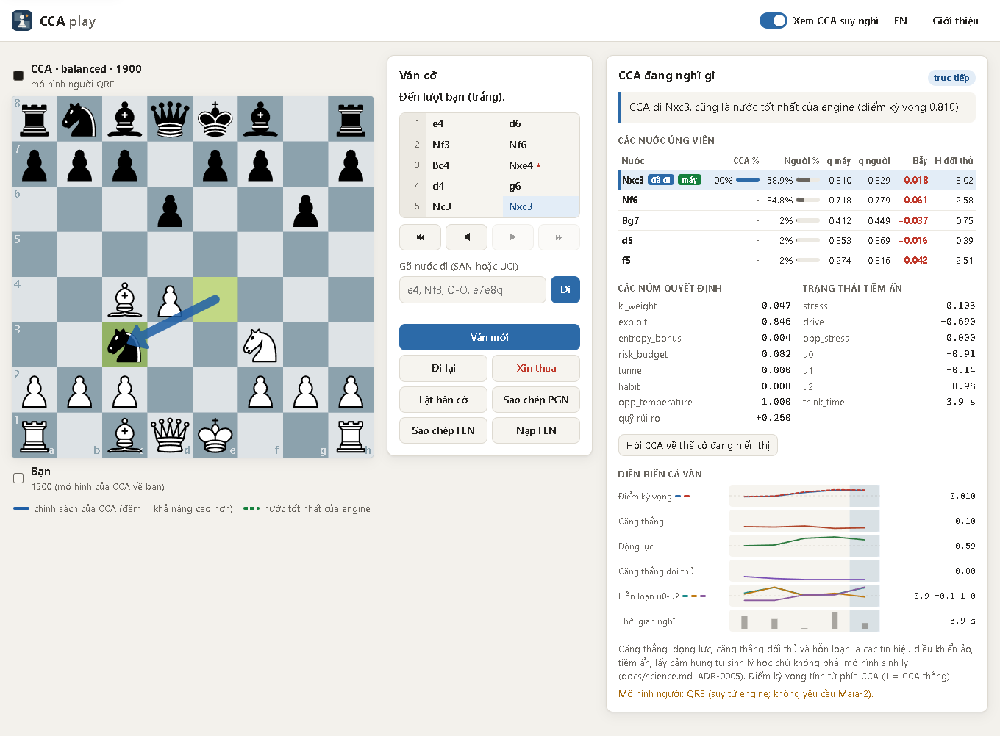

# CCA

[](https://github.com/DonQuaan/CCA/actions/workflows/ci.yml)
[](LICENSE)
[](pyproject.toml)

English: [README.md](README.md). Các tài liệu khác mà trang này liên kết tới (thư mục `docs/`,
`CHANGELOG.md`, `CONTRIBUTING.md`, `SECURITY.md`, `THIRD_PARTY_NOTICES.md`, ...) hiện chỉ có bằng
tiếng Anh.

**CCA** (viết tắt của *Chaotic Chess Algorithm*) là một dự án nghiên cứu và học tập: một lớp ra
quyết định đặt trên **Stockfish 19** và một **mô hình nước đi của người** (Maia-2, hoặc mô hình
cơ sở QRE suy ra từ engine). CCA được thiết kế để chơi cờ theo lối **giống người**, **khó đoán**
và **nhắm vào những sai lầm mà một người chơi ở rating của đối thủ dễ mắc** (theo dự đoán của
Maia-2 hoặc QRE ở rating đó), trong khi mỗi nước đi chỉ được phép hy sinh so với nước tốt nhất
của Stockfish một lượng điểm kỳ vọng có giới hạn, nằm trong một ngân sách. Stockfish chỉ làm nhiệm
vụ *đo*; nước đi do lõi ra quyết định riêng của CCA, C-AIME, lựa chọn
([ADR-0003](docs/adr/0003-stockfish-as-perception-not-policy.md)). Bạn có thể chơi với CCA trong
một trình mô phỏng trên trình duyệt hiển thị trực tiếp các tín hiệu quyết định của nó, chạy nó
như một engine UCI trong các phần mềm cờ (GUI) và lichess-bot, và tìm hiểu từng cơ chế: cơ chế nào
cũng được ghi lại kèm công thức và tình trạng khoa học của nó.

> **Tình trạng nghiên cứu (v0.1.0).** Kiến trúc đã được hiện thực và kiểm thử. Các tuyên bố về
> hành vi của nó (giống người, khó đoán, giăng bẫy người chơi) là **giả thuyết**, kèm tiêu chí
> bác bỏ được đăng ký trước trong
> [`docs/science.md`](docs/science.md#2-pre-registered-falsifiable-predictions); v0.1.0 không báo
> cáo kết quả nào cho các giả thuyết đó. "Căng thẳng" (stress) và "động lực" (drive) là các biến
> điều khiển ảo *lấy cảm hứng từ* sinh lý học con người, không phải mô hình sinh lý
> ([ADR-0005](docs/adr/0005-honest-science-labelling.md)). Các tham số được đặt thủ công đều mang
> nhãn "not fitted" (chưa khớp dữ liệu).



*`cca play` (tiếng Việt, nền sáng) sau 1.e4 d6 2.Nf3 Nf6 3.Bc4 Nxe4 4.d4 g6 5.Nc3 Nxc3: CCA cầm
Đen (`balanced`, 1900, mô hình người QRE). Mũi tên xanh dương là chính sách (policy) của nó; ở đây
không có mũi tên xanh lá nét đứt vì nước tốt nhất của engine trùng với nước CCA chọn (trình mô
phỏng chỉ vẽ mũi tên đó khi hai nước khác nhau). Bảng bên phải giải thích lựa chọn ("CCA đi Nxc3,
cũng là nước tốt nhất của engine (điểm kỳ vọng 0.810)"), liệt kê các nước ứng viên (CCA %, Người %,
q máy, q người, Bẫy, H đối thủ; Nxc3 là ứng viên duy nhất nằm trong ngân sách rủi ro, các nước còn
lại hiện "-" ở cột CCA %) và hiển thị các núm, trạng thái tiềm ẩn cùng biểu đồ theo từng nước. Giao
diện tiếng Anh, nền tối: [`docs/img/cca-play-dark.png`](docs/img/cca-play-dark.png).*

## Điểm nổi bật

- **Mô hình quyết định:** Stockfish 19 MultiPV + WDL cho ra `q_opt`, điểm kỳ vọng theo đánh giá
  của Stockfish; phân phối tiên nghiệm (prior) kiểu người của chính agent (Maia-2 ở rating của nó)
  làm điểm neo piKL; một phép nhìn trước 2 nửa nước (2-ply) theo phân phối nước đáp kiểu người của
  *đối thủ* cho ra `q_human`, giá trị bẫy và entropy quyết định của đối thủ. Chỉ những nước nằm
  trong ngân sách rủi ro so với nước tốt nhất của engine mới đủ điều kiện được chọn.
- **Trình mô phỏng trên trình duyệt** (`cca play`): theo dõi chính sách, các nước ứng viên, các
  núm, trạng thái tiềm ẩn và biểu đồ của CCA qua từng nước; có tiếng Anh và tiếng Việt; chế độ ván
  công bằng ẩn những thứ này cho tới khi hết ván.
- **Engine UCI** (`cca-uci`, `cca uci`) kèm hướng dẫn thiết lập cho Cute Chess, Arena, En
  Croissant, BanksiaGUI, Scid vs. PC, ChessBase và lichess-bot (chỉ với tài khoản BOT của Lichess).
- **Container image** `ghcr.io/donquaan/cca` (có sẵn Stockfish 19) và `-maia2` (PyTorch bản chỉ
  CPU): linux/amd64, có chứng thực nguồn gốc bản dựng (build provenance) được ký.
- **Tái lập:** RNG có seed, bộ tạo hỗn loạn Lorenz-63 tái lập được đến từng bit, phát lại ở chế độ
  giới hạn số nút (node), seed kiểu cam kết – công bố (commit–reveal) khi chơi trực tuyến, một
  manifest cho mỗi lần chạy benchmark, Stockfish và Maia-2 được ghim bằng SHA-256.
- **Khoa học trung thực:** mỗi cơ chế hành vi là một giả thuyết được ghi nhãn, kèm một dự đoán có
  thể bác bỏ; bộ tạo hỗn loạn đi kèm một đối chứng AR(1) đã hiệu chỉnh cho phép thử A/B của nó.

## Bắt đầu nhanh

Có ba cách chạy CCA 0.1.0. Cách nào cũng cần Stockfish 19; chỉ các container image có sẵn nó.
Nếu các tệp phát hành hoặc các image chưa có (HTTP 404, hoặc `docker pull` trả về `denied`), hãy
dùng [3. Từ mã nguồn](#3-từ-mã-nguồn).

### 1. Docker (chỉ cần Docker)

Bạn cần Docker (Docker Desktop trên Windows và macOS). Image nằm trên GitHub Packages, **chỉ cho
linux/amd64**: không có image arm64, và trên máy arm64, Docker có thể chạy chúng qua giả lập
(chưa kiểm thử). `ghcr.io/donquaan/cca:0.1.0` (cũng là `latest`) chứa CCA, Stockfish 19 và mô hình
QRE, và chạy `cca play --host 0.0.0.0 --port 8765 --no-browser --human qre`; `:0.1.0-maia2` (cũng
là `latest-maia2`) bổ sung Maia-2 0.11 trên PyTorch 2.8.0 bản chỉ CPU và chạy trình mô phỏng với
`--human maia2 --device cpu`.

```bash
# Trình mô phỏng trên trình duyệt: mở http://127.0.0.1:8765/ khi container báo healthy
docker run --rm -p 127.0.0.1:8765:8765 ghcr.io/donquaan/cca:0.1.0

# Engine UCI qua stdin/stdout: dùng -i nhưng không bao giờ dùng -t; không có web server nào chạy nên không có health check
docker run -i --rm --no-healthcheck ghcr.io/donquaan/cca:0.1.0 uci

# Maia-2: checkpoint rapid (khoảng 280 MB, 267 MiB) được tải ở lần khởi động đầu tiên vào volume cca-data
docker run --rm -p 127.0.0.1:8765:8765 -v cca-data:/data ghcr.io/donquaan/cca:0.1.0-maia2
docker run -i --rm --no-healthcheck -v cca-data:/data ghcr.io/donquaan/cca:0.1.0-maia2 uci

# Kiểm tra môi trường (phiên bản, banner của Stockfish)
docker run --rm --no-healthcheck ghcr.io/donquaan/cca:0.1.0 doctor
```

- Chỉ mở (publish) cổng trên `127.0.0.1`: bên trong container, server lắng nghe trên `0.0.0.0` và không
  có xác thực. Image chạy với uid 10001 dưới `tini`; giấy phép và toàn bộ mã nguồn của Stockfish
  nằm trong `/usr/local/share/doc/stockfish/`.
- Không image nào chứa trọng số Maia-2 (chưa có giấy phép nào được công bố cho chúng): `maia2` tải
  chúng từ nguồn chính thức vào `/data/maia2` và kiểm tra SHA-256 của chúng; ở các lần khởi động
  sau, CCA đối chiếu tệp với mã ghim của chính CCA trước khi torch nạp nó. Hãy khởi động trình mô
  phỏng `-maia2` một lần trước khi dùng chế độ UCI của nó, để checkpoint có sẵn trong volume
  (health check cho phép 600 s cho lần khởi động đầu tiên đó).
- `docker pull` trả về `denied` nghĩa là package chưa được công khai: hãy dùng
  [3. Từ mã nguồn](#3-từ-mã-nguồn), hoặc tự dựng image trên máy mình bằng các lệnh ở đầu
  [`Dockerfile`](Dockerfile). Thêm chi tiết: [`docs/docker.md`](docs/docker.md), kể cả phần
  [giới hạn đã biết](docs/docker.md#known-limits) của nó.

### 2. Wheel bản phát hành + Stockfish 19 tự cài

Cần Python 3.11–3.13 (đã kiểm thử; 3.11 hoặc 3.12 nếu dùng Maia-2). Trên Windows, hãy cài Python
từ [python.org](https://www.python.org/downloads/); trên Debian hoặc Ubuntu, nếu `venv` báo lỗi,
hãy cài gói `python3-venv` mà thông báo lỗi nêu tên. Wheel
[`cca_chess-0.1.0-py3-none-any.whl`](https://github.com/DonQuaan/CCA/releases/tag/v0.1.0)
**không** chứa Stockfish: hãy tự cài bản build chính thức `sf_19` và đối chiếu nó với các mã
SHA-256 được ghim trong [`engines/stockfish.lock.json`](engines/stockfish.lock.json).

Linux:

```bash
python3.13 -m venv cca-env      # hoặc python3.11 / python3.12
cca-env/bin/python -m pip install https://github.com/DonQuaan/CCA/releases/download/v0.1.0/cca_chess-0.1.0-py3-none-any.whl

curl -LO https://github.com/official-stockfish/Stockfish/releases/download/sf_19/stockfish-linux-x86-64-universal.tar.gz
echo "9defc0d4e55d49c65a6d042f3e571a39fcea499ade6dbe741b53b8c65e03611f  stockfish-linux-x86-64-universal.tar.gz" | sha256sum -c -
tar -xzf stockfish-linux-x86-64-universal.tar.gz
export CCA_STOCKFISH="$PWD/stockfish/stockfish-linux-x86-64-universal"

cca-env/bin/cca doctor   # kết quả mong đợi: "engine ok: Stockfish 19 (...)"
cca-env/bin/cca play     # trình mô phỏng tại http://127.0.0.1:8765/; qua SSH hoặc trên máy không có màn hình: cca play --no-browser
```

`export` chỉ có hiệu lực trong phiên shell hiện tại: hãy thêm dòng đó vào tệp profile của shell,
hoặc truyền `--stockfish <path>`. Với macOS, dùng `stockfish-macos-universal.tar.gz`, mã ghim của
nó trong cùng tệp lock và `shasum -a 256 -c -` thay cho `sha256sum -c -`; `tar -tzf` cho biết
đường dẫn của tệp thực thi bên trong archive đó.

Windows (PowerShell):

```powershell
py -3.13 -m venv cca-env        # hoặc -3.11 / -3.12
.\cca-env\Scripts\python -m pip install https://github.com/DonQuaan/CCA/releases/download/v0.1.0/cca_chess-0.1.0-py3-none-any.whl

curl.exe -LO https://github.com/official-stockfish/Stockfish/releases/download/sf_19/stockfish-windows-x86-64-universal.zip
if ((Get-FileHash stockfish-windows-x86-64-universal.zip -Algorithm SHA256).Hash -ne '3C8BF1F9EA66A09350A40DF4F632288285AC206D99F33AB5842C408FC30B48A7') { throw 'SHA-256 mismatch' }
Expand-Archive stockfish-windows-x86-64-universal.zip -DestinationPath .
$env:CCA_STOCKFISH = "$PWD\stockfish\stockfish-windows-x86-64-universal.exe"

.\cca-env\Scripts\cca doctor
.\cca-env\Scripts\cca play
```

Hãy gõ `curl.exe`, không phải `curl`: trong Windows PowerShell 5.1, `curl` là bí danh (alias) của
`Invoke-WebRequest`. `$env:CCA_STOCKFISH` chỉ có hiệu lực trong phiên PowerShell hiện tại. Để giữ
lâu dài, hãy chạy
`setx CCA_STOCKFISH "$PWD\stockfish\stockfish-windows-x86-64-universal.exe"` (chỉ áp dụng cho các
chương trình khởi động sau đó), hoặc truyền `--stockfish <path>`. Nếu `cca doctor` gợi ý chạy
`scripts/fetch_stockfish.py`: script đó chỉ có trong bản checkout mã nguồn, không có trong wheel.

Nếu dùng uv thay cho pip, `uv tool install --python 3.12 <wheel URL>` cài `cca` và `cca-uci` vào
thư mục chứa tệp thực thi của các tool uv (`uv tool dir --bin` in ra thư mục đó;
`uv tool update-shell` thêm nó vào `PATH`).

**CCA tìm Stockfish theo thứ tự:** `--stockfish PATH` (hoặc tùy chọn UCI `StockfishPath`), rồi
`$CCA_STOCKFISH`, rồi `engines/stockfish-*` trong một bản checkout mã nguồn, cuối cùng là
`stockfish` trên `PATH`. Một đường dẫn tường minh hoặc `CCA_STOCKFISH` không trỏ tới một tệp là
lỗi, CCA không bao giờ âm thầm chuyển sang lựa chọn khác. GUI cờ và lichess-bot có thể không kế
thừa các biến môi trường đặt trong terminal: khi đó hãy đặt `StockfishPath` trong tùy chọn của
engine.

**Maia-2 (tùy chọn)** cần một môi trường riêng với Python 3.11 hoặc 3.12 (`maia2` 0.11 hỗ trợ
Python 3.10–3.12; trên 3.13, extra `maia2` không cài gì cả). Trên Windows, làm đúng theo thứ tự:

1. `py -3.12 -m venv cca-maia2`
2. Chỉ khi có GPU NVIDIA (wheel `torch` trên PyPI cho Windows chỉ chạy CPU):
   `.\cca-maia2\Scripts\python -m pip install torch==2.8.0 --index-url https://download.pytorch.org/whl/cu128`
3. `.\cca-maia2\Scripts\python -m pip install "cca-chess[maia2] @ https://github.com/DonQuaan/CCA/releases/download/v0.1.0/cca_chess-0.1.0-py3-none-any.whl"`

Bước 2 phải làm trước: pip giữ nguyên một `torch==2.8.0` đã được cài, nên chạy lệnh CUDA sau bước
3 sẽ không thay đổi gì. Nếu wheel CPU đã có sẵn, hãy chạy `python -m pip uninstall -y torch` trong
môi trường đó, rồi làm bước 2. Trên Linux, dùng `python3.12 -m venv` và `<env>/bin/python`; ở đó
wheel `torch` trên PyPI kéo theo các thư viện CUDA (các gói `nvidia-*`), nên trên máy không có GPU
NVIDIA, hãy chạy
`python -m pip install torch==2.8.0 --index-url https://download.pytorch.org/whl/cpu` làm bước 2.
Đặt `CCA_WEIGHTS` trỏ tới một thư mục để chứa checkpoint (mặc định checkpoint được lưu bên trong
môi trường Python).

### 3. Từ mã nguồn

Cần [uv](https://docs.astral.sh/uv/) và Python 3.11–3.13 (đã kiểm thử; 3.11 hoặc 3.12 nếu dùng
Maia-2).

```bash
git clone https://github.com/DonQuaan/CCA.git
cd CCA
uv sync                                    # lõi + công cụ phát triển trong .venv
uv run python scripts/fetch_stockfish.py   # Stockfish 19 vào engines/, có kiểm SHA-256
uv run cca doctor
uv run cca play                            # mở http://127.0.0.1:8765/ trong trình duyệt của bạn (--no-browser khi qua SSH)
```

`fetch_stockfish.py` tải bản build cho hệ điều hành đang dùng (x86-64 trên Linux và Windows,
universal trên macOS) vào `engines/`, nơi CCA tự tìm thấy nó mà không cần `CCA_STOCKFISH`: hãy bỏ
qua lời gợi ý đặt biến đó ở cuối đầu ra của script. Nếu mã băm của tệp khác với mã đã ghim, script
dừng lại và xóa tệp vừa tải. `--os linux|windows|macos` tải bản build cho nền tảng khác; trên Linux
arm64, dùng `--arch arm64`, bản này chưa được ghim: khi đó script lấy SHA-256 mà GitHub API công bố
cho tệp đó và thêm nó vào `engines/stockfish.lock.json`.

Nếu không có Maia-2, `cca play` chuyển sang mô hình QRE và nêu lý do ngay trên trang (`--human qre`
bỏ qua bước thử Maia-2). Gợi ý trên trang về việc chạy `uv sync --extra maia2` chỉ có tác dụng
trong môi trường Python 3.11 hoặc 3.12: `uv sync` có thể chọn Python 3.13, nơi extra đó không cài
gì cả. Để dùng Maia-2 trong `.venv` chính, hãy chạy `uv sync --python 3.12 --extra maia2`; lệnh
này thay `.venv` bằng một môi trường Python 3.12 và cài `torch` từ PyPI (trên Windows là bản chỉ
CPU), và một lần `uv sync` thông thường sau đó sẽ gỡ extra này đi. Muốn dùng CUDA trên Windows,
hãy theo công thức dưới đây.

**Môi trường Maia-2** (`maia2` 0.11 chỉ hỗ trợ Python 3.10–3.12). Công thức dưới đây đã được dùng
cho đợt kiểm chứng v0.1.0 trên RTX 4060 (Python 3.12.13, torch 2.8.0+cu128, maia2 0.11.0). Hãy
chạy nó trong Git Bash hoặc PowerShell (không dùng `cmd.exe`):

```bash
uv venv .venv-maia2 --python 3.12
uv pip install --python .venv-maia2 torch==2.8.0 --index-url https://download.pytorch.org/whl/cu128   # GPU NVIDIA trên Windows; Linux không có GPU: .../whl/cpu
uv pip install --python .venv-maia2 -e ".[maia2]" pytest hypothesis
.venv-maia2/Scripts/cca play      # Linux/macOS: .venv-maia2/bin/cca
```

Lần dùng đầu tiên sẽ tải checkpoint rapid (khoảng 280 MB, 267 MiB) vào `weights/maia2/` (đổi chỗ
lưu bằng `CCA_WEIGHTS`); `maia2` kiểm tra SHA-256 của tệp tải về, và CCA từ chối mọi checkpoint đã
có sẵn mà SHA-256 khác với mã ghim của CCA.

## Chơi trong trình mô phỏng

`cca play` chạy một ứng dụng web cục bộ tại `127.0.0.1:8765` (HTTP server của thư viện chuẩn, mã
bàn cờ được vendor sẵn; trang không tải gì từ máy chủ khác) và mở trình duyệt của bạn. Hướng
dẫn đầy đủ: [`docs/simulator.md`](docs/simulator.md). Tên nút và mục in nghiêng dưới đây là nhãn
của giao diện tiếng Việt.

- **Bàn cờ:** chính sách của CCA hiện thành các mũi tên xanh dương (càng đậm càng có khả năng),
  nước tốt nhất của engine là mũi tên xanh lá nét đứt. **Thẻ *Ván cờ*:** danh sách nước đi và các
  nút duyệt, ô nhập nước đi, *Ván mới*, *Đi lại*, *Xin thua*, *Lật bàn cờ*, *Sao chép PGN*, *Sao
  chép FEN*, *Nạp FEN*.
- **Bảng *CCA đang nghĩ gì*:** một câu giải thích vì sao CCA chọn nước đó; bảng *Các nước ứng
  viên* gồm *CCA %* (chính sách cuối cùng; "-" = ngoài ngân sách rủi ro), *Người %* (prior người
  ở rating của CCA), *q máy* (điểm kỳ vọng của CCA nếu bạn đáp hoàn hảo), *q người* (nếu bạn đáp
  như một người chơi ở rating của bạn), *Bẫy* (q người − q máy) và *H đối thủ* (entropy của các
  nước đáp khả dĩ của bạn, tính bằng nat); *Các núm quyết định* `kl_weight`, `exploit`,
  `entropy_bonus`, `risk_budget`, `tunnel`, `habit`, `opp_temperature` và *quỹ rủi ro*; *Trạng thái
  tiềm ẩn* `stress`, `drive`, `opp_stress`, các tín hiệu hỗn loạn `u0`–`u2`, `think_time`; một
  **phòng thí nghiệm thế cờ** (*Hỏi CCA về thế cờ đang hiển thị*); và **biểu đồ cả ván** (*Diễn
  biến cả ván*) cho điểm kỳ vọng, căng thẳng, động lực, căng thẳng đối thủ, hỗn loạn và thời gian
  nghĩ.
- **Ván mới:** cầm Trắng, Đen hoặc Ngẫu nhiên; persona (*Phong cách của CCA*); Elo của CCA
  (800–2600); Elo của bạn theo mô hình của CCA (400–3000); *Không tính giờ*, 3+2, 5+3, 10+5 hoặc
  15+10 (số phút + số giây cộng thêm mỗi nước; server giữ đồng hồ); tùy chọn thêm độ trễ suy nghĩ
  kiểu người (*Mô phỏng thời gian nghĩ như người*), seed (*Hạt giống*) và FEN khởi đầu. Chỉ được đi
  lại trong ván không tính giờ.
- **Ván công bằng:** tắt *Xem CCA suy nghĩ* để ẩn bảng và các mũi tên cho tới khi hết ván (chỉ ẩn
  trong trình duyệt; API cục bộ vẫn trả về mọi quyết định).
- **Ngôn ngữ:** tiếng Anh và tiếng Việt (nút *VI* / *EN*; lựa chọn ban đầu theo ngôn ngữ của trình
  duyệt); nền sáng hoặc tối theo thiết lập của hệ thống.
- **Bàn phím:** ô nhập nước đi nhận SAN hoặc UCI (`e4`, `Nf3`, `O-O`, `e7e8q`; nước phong cấp phải
  ghi rõ quân); `←` `→` `Home` `End` để duyệt qua ván.
- **Seed:** ván không có seed sẽ nhận một seed bí mật, được cam kết bằng SHA-256 trong lúc chơi và
  công bố khi hết ván. Chơi lại một ván không tính giờ với cùng seed, thiết lập và nước đi sẽ lặp
  lại các quyết định của CCA khi việc tìm kiếm của engine và mô hình người là tất định (engine một
  luồng; `ucinewgame` trước mỗi quyết định, mất khoảng 25 ms;
  [ADR-0007](docs/adr/0007-simulator-and-distribution.md)).

Các flag của server: `--host` (mặc định là loopback; địa chỉ khác sẽ in cảnh báo, vì không có xác
thực), `--port` (`0` = một cổng trống bất kỳ), `--no-browser` (dùng khi qua SSH hoặc trên máy không
có desktop), `--max-sessions`, cùng các flag engine ở phần dưới. `GET /healthz` trả về
`{"status": "ok", "version": ..., "ready": ...}`.

## Dùng CCA làm engine UCI

`cca-uci` chính là `cca uci`, dành cho các chương trình không truyền được tham số (nó bỏ qua mọi
tham số truyền cho chính nó); trên Windows nó là `<env>\Scripts\cca-uci.exe`, ở các hệ khác là
`<env>/bin/cca-uci` (trong bản checkout mã nguồn, `<env>` là `.venv`). CCA trả lời `uci`,
`isready`, `setoption`, `ucinewgame`, `position`, `go` (các trường đồng hồ, `movestogo`,
`movetime`, `infinite`, `ponder`), `ponderhit`, `stop` và `quit`. `go depth/nodes/mate/searchmoves`
được chấp nhận nhưng không được áp dụng (một dòng `info string` cho biết điều đó): ngân sách tính
toán là `CCA_Nodes` cộng với đồng hồ. Mỗi nước đi kèm một báo cáo
`info string cca q_opt=… q_human=… trap=… stress=… …`. Thiết lập cho từng chương trình:
[`docs/gui-integration.md`](docs/gui-integration.md).

| Chương trình | Cách thêm CCA |
|---|---|
| Cute Chess GUI | Tools → Settings → Engines → Add; *Command*: đường dẫn đầy đủ của `cca-uci` (hộp thoại không có ô tham số); *Protocol*: uci. |
| cutechess-cli | `-engine name=CCA cmd=/path/to/cca-uci proto=uci` (hoặc `cmd=/path/to/cca arg=uci`). |
| Arena (Windows) | Engines → Install New Engine → `cca-uci.exe`, kiểu UCI. |
| En Croissant | Engines → Add New → Local → *Binary file* `cca-uci.exe`; chương trình này không truyền được tham số. |
| BanksiaGUI | Engines → Manage Engines → Add → `cca-uci`; hãy dùng các chế độ theo thời gian (giới hạn độ sâu không được áp dụng). |
| Scid vs. PC | Tools → Analysis Engines, thêm một engine; *Command*: đường dẫn đầy đủ của `cca-uci` (để trống *Parameters*), hoặc đường dẫn đầy đủ của `cca` với *Parameters* `uci`; giao thức UCI. Scid bỏ qua các tùy chọn `UCI_*`, nên hãy đặt `CCA_OpponentElo`. |
| ChessBase / Fritz | Fritz 19: Engines → Create UCI Engine; ChessBase 18: Home → UCI Engine; duyệt tới `cca-uci.exe`. |
| lichess-bot | `engine.name: cca-uci` (xem bên dưới). |
| Docker | GUI chỉ khởi chạy một tệp thực thi: dùng một script bọc (wrapper) chạy `docker run -i --rm --pull=never --no-healthcheck ghcr.io/donquaan/cca:0.1.0 uci` (tệp `.bat` cần `@echo off`; hãy pull image trước). Xem [gui-integration §11](docs/gui-integration.md#11-docker). |

Các bước trên lấy từ mã nguồn hoặc tài liệu của từng chương trình (Arena: từ hướng dẫn của bên thứ
ba). CCA đã được kiểm thử qua python-chess 1.11.2, tầng engine của lichess-bot, với Stockfish 19
trên Windows; chưa chạy thử với GUI nào (kể cả việc ChessBase có chấp nhận launcher hay không).

**lichess-bot.** Trỏ `engine.dir` tới thư mục `Scripts` hoặc `bin` của môi trường và xóa
`SyzygyPath` cùng `UCI_ShowWDL` khỏi `uci_options` mặc định: python-chess từ chối cấu hình những
tùy chọn mà CCA không khai báo (`Move Overhead` thì được hỗ trợ). Ponder chỉ được bật/tắt bằng
`engine.ponder`, không bao giờ qua `uci_options`; `bestmove` của CCA không kèm nước ponder, nên ở
v0.1.0 thực tế không có gì ponder cả. Cấu hình đầy đủ:
[gui-integration §10.2](docs/gui-integration.md#102-configure-the-engine).

```yaml
engine:
  dir: "/home/me/cca-env/bin/"   # Windows: "C:/Users/me/cca-env/Scripts/"
  name: "cca-uci"                # Windows: "cca-uci.exe"
  protocol: "uci"
  ponder: false
  uci_options:
    Move Overhead: 100
    Threads: 1
    Hash: 256
    StockfishPath: "/home/me/stockfish/stockfish-linux-x86-64-universal"   # nếu bot không thấy CCA_STOCKFISH
    CCA_Persona: "balanced"
```

**Chơi công bằng.** Trên Lichess, CCA **chỉ** được chơi từ một tài khoản BOT (việc nâng cấp là
không thể đảo ngược và cần một tài khoản chưa từng chơi ván nào).
[Quy định fair play](https://lichess.org/page/fair-play) cho phép engine chơi qua Bot API và cấm
dùng engine trong ván của tài khoản người: làm vậy là gian lận.

## Tham chiếu dòng lệnh

| Lệnh | Mục đích |
|---|---|
| `cca play` | chơi với CCA trong trình duyệt và xem các tín hiệu quyết định của nó |
| `cca uci` (= `cca-uci`) | chạy như một engine UCI qua stdin/stdout |
| `cca analyse FEN` | một quyết định trên một FEN, xuất JSON (nước đi, chính sách, các núm, trạng thái, thời gian nghĩ, trace, các nước ứng viên, digest của bộ tạo hỗn loạn) |
| `cca match` | đấu một trận benchmark trên đồng hồ ảo (PGN + JSONL + `summary.json`) |
| `cca doctor` | kiểm tra môi trường; thoát với mã 0 nếu dùng được Stockfish |
| `cca version` | in phiên bản |

Các flag dùng chung cho `analyse`, `match` và `play`: `--stockfish PATH`, `--threads`, `--hash`,
`--nodes` (mỗi lần đánh giá), `--human maia2|qre`, `--maia2-type rapid|blitz`, `--device gpu|cpu`
(CPU nếu không có CUDA), `--persona NAME|FILE.toml`, `--config FILE.toml`, `--elo-self`,
`--elo-oppo`, `--seed`, `--argmax` (lấy argmax tất định thay vì lấy mẫu). `cca match` có thêm
`--opponent human|stockfish`, `--games`, `--base`, `--inc`, `--referee-nodes`, `--max-plies` và
`--out`. Mọi flag kèm kiểu dữ liệu và giá trị mặc định:
[`docs/reference.md`](docs/reference.md#3-command-line-interface).

```bash
uv run cca analyse "r1bqkbnr/pppp1ppp/2n5/4p3/4P3/5N2/PPPP1PPP/RNBQKB1R w KQkq - 2 3" --human qre --persona tal
uv run cca match --persona tal --opponent human --elo-oppo 1500 --games 10 --out runs/tal-vs-1500
```

Với `analyse` và `match`, nếu thiếu extra Maia-2 thì CCA chuyển sang QRE kèm cảnh báo (được ghi
vào manifest); `play` chuyển sang QRE khi Maia-2 lỗi vì bất kỳ lý do gì và hiển thị lý do.
`--opponent stockfish` dùng `UCI_LimitStrength` của chính Stockfish với `UCI_Elo` bị kẹp trong
khoảng 1320–3190 (thang của Stockfish, không phải Elo của người); các lần chạy như vậy được đánh
dấu là không tái lập được. `--config` đọc một tệp TOML kiểm tra chặt với các mục `[agent]`,
`[persona]`, `[neuro]`, `[lorenz]`, `[timing]`
([tham chiếu §5](docs/reference.md#5-configuration)), ví dụ persona `tal` với bộ tạo hỗn loạn đối
chứng AR(1):

```toml
[agent]
chaos_driver = "ar1"

[persona]
preset = "tal"
eps_max = 0.1
```

## Tùy chọn UCI

Những tùy chọn người dùng GUI thường thay đổi. Toàn bộ 16 tùy chọn kèm kiểu, giá trị mặc định và
khoảng giá trị: [tham chiếu §4](docs/reference.md#4-uci-options).

| Tùy chọn | Ý nghĩa |
|---|---|
| `StockfishPath` | Tệp thực thi Stockfish; mặc định `<auto>` dùng thứ tự dò tìm ở trên. Hãy đặt nó khi GUI không thấy `CCA_STOCKFISH`. |
| `CCA_HumanModel` | `maia2` hoặc `qre`. Maia-2 cần extra và trọng số của nó; nếu thiếu, CCA chuyển sang QRE và thông báo điều đó. |
| `UCI_Elo` | Rating của người chơi mà CCA bắt chước (điểm neo prior người của nó). |
| `UCI_LimitStrength` | `false` bỏ qua `UCI_Elo` và bắt chước mức cao nhất trong khoảng của nó. Đặc tả UCI gợi ý mặc định là `false`; CCA giữ `true` để `UCI_Elo` luôn có hiệu lực ([ADR-0007](docs/adr/0007-simulator-and-distribution.md)). |
| `CCA_OpponentElo` | Rating của đối thủ khi `UCI_Opponent` không có rating (GUI hoặc lichess-bot có thể gửi `UCI_Opponent`; khi đó rating trong `UCI_Opponent` được ưu tiên). |
| `Move Overhead` | Số mili giây trừ khỏi mọi hạn chót theo đồng hồ/`movetime`; hãy tăng nó nếu CCA thua vì hết giờ. |
| `CCA_Persona` | Phong cách chơi có sẵn ([Persona](#persona)). |

Tên tùy chọn được so khớp chính xác (phân biệt chữ hoa, chữ thường); tùy chọn không xác định được
trả lời bằng `info string ignoring unknown option <name>` và bị bỏ qua. Một số nguyên nằm ngoài
khoảng cho phép sẽ bị kẹp về khoảng của tùy chọn đó; mọi giá trị không hợp lệ khác (không phải số
nguyên, không thuộc các giá trị của combo, không phải `true`/`false`, một `StockfishPath` không trỏ
tới tệp) bị từ chối bằng một `info string error: …` và giá trị cũ được giữ nguyên.

## Cách hoạt động

Lõi quyết định mang tên C-AIME (*Chaotic Active-Inference MCTS Engine*) theo lộ trình phát triển
của nó: **v0.1 chưa có tìm kiếm cây** và chưa có bộ điều khiển Active Inference; một phép nhìn
trước 2 nửa nước có tính tới hành vi của người chơi và một chính sách piKL dạng nghiệm đóng tạm
thay cho phép tìm kiếm do hỗn loạn dẫn dắt đã được lên kế hoạch
([ADR-0003](docs/adr/0003-stockfish-as-perception-not-policy.md),
[lộ trình](docs/architecture.md#roadmap-not-in-v01)). Với mỗi nước đi, `CAIMEAgent.choose`:

1. **Tri giác (perceive):** Stockfish MultiPV với WDL cho mỗi nước ở gốc một giá trị `q_opt`, điểm
   kỳ vọng theo đánh giá của Stockfish (`W + D/2`, trong `[0, 1]`, tính từ phía CCA).
2. **Thẩm định (appraise)** nước vừa đi của đối thủ so với phân phối nước đáp mà CCA đã dự đoán:
   nước đó bất ngờ tới mức nào, và giá trị của thế cờ lệch khỏi dự đoán bao xa.
3. **Cập nhật trạng thái tiềm ẩn:** `stress` và `drive` (biến điều khiển ảo, không phải sinh lý)
   phản ứng với các tín hiệu đó và với áp lực đồng hồ. Một ước lượng về căng thẳng của *đối thủ*
   được điều khiển bởi mức bất ngờ của nước CCA theo chính prior người của CCA (một đại lượng thay
   thế cho mức bất ngờ của đối thủ) và bởi áp lực đồng hồ của đối thủ.
4. **Cho bộ tạo hỗn loạn tiến thêm một bước:** một dao động tử Lorenz-63 có cưỡng bức (hoặc đối chứng AR(1) đã hiệu
   chỉnh) biến các tín hiệu đó thành ba đầu vào bị chặn `u0`–`u2`.
5. **Thu thập ứng viên:** các nước hàng đầu của Stockfish cộng với các nước kiểu người có khả năng
   nhất theo chính CCA. Trong `opening_plies` (10) nửa nước đầu tiên, khi trên bàn còn ít nhất
   `opening_min_pieces` (28) quân, prior người được làm dịu (tempered), vì Maia-2 không được huấn
   luyện ở giai đoạn đó.
6. **Đặt các núm** (trọng số KL, trọng số khai thác, điểm thưởng entropy, ngân sách rủi ro `ε`,
   tầm nhìn hẹp, thói quen, nhiệt độ đối thủ) từ trạng thái và hỗn loạn, qua các ánh xạ bị chặn với
   hệ số theo persona; một quỹ rủi ro cộng thêm phần đối thủ đã cho đi và trừ đi phần rủi ro CCA đã
   dùng.
7. **Nhìn trước như một đối thủ là người:** với mỗi ứng viên, phân phối nước đáp kiểu người của đối
   thủ ở rating của đối thủ cho ra `q_human`, giá trị bẫy `q_human − q_opt` và entropy của các nước
   đáp khả dĩ của đối thủ.
8. **Quyết định:** chỉ những nước có `q_opt ≥ max q_opt − ε` mới đủ điều kiện (nước tốt nhất của
   engine luôn đủ; `ε` không bao giờ vượt `eps_max` của persona, trong phạm vi mà Stockfish biết
   `q_opt` với ngân sách số nút của nó). Chính sách là nghiệm piKL dạng đóng
   `π(a) ∝ τ(a) exp(U(a) / λ_KL)` (Jacob et al. 2022) trên một hàm tiện ích kết hợp `q_opt`,
   `q_human` và entropy của nước đáp, neo vào prior người của CCA, và được lấy mẫu bằng một RNG có
   seed (`--argmax` lấy nước có xác suất cao nhất).
9. **Lấy mẫu thời gian nghĩ** từ giai đoạn ván, độ phức tạp của thế cờ và nhiễu log-normal, bị
   chặn trên bởi đồng hồ.

Mọi phương trình đúng như mã nguồn ghi lại: [tham chiếu §9](docs/reference.md#9-model-equations);
mọi giá trị cấu hình mặc định (đặt thủ công, chưa khớp dữ liệu): [§5](docs/reference.md#5-configuration);
lý do thiết kế, những gì được bảo đảm và không được bảo đảm:
[`docs/architecture.md`](docs/architecture.md).

**Thời gian thực.** Khi không có hạn chót (`analyse`, `match`), tìm kiếm bị giới hạn theo số nút
và tái lập được. Dưới đồng hồ UCI, CCA đặt một hạn chót theo giờ thực (từ `movetime` hoặc ngân
sách mỗi nước của nó, trừ đi `Move Overhead`), cấp cho mỗi lần gọi engine một lát thời gian và
cắt phép nhìn trước khi hết giờ (các ứng viên còn lại giữ `q_human = q_opt`); dưới `fast_budget`,
CCA trả lời ở **chế độ phản xạ** bằng nước tốt nhất của engine, và `stop` cắt ngắn quá trình này.
Chi phí mỗi nước: một lần tìm kiếm MultiPV ở gốc, tối đa thêm một lần cho các ứng viên bổ sung từ
prior, một lần tìm kiếm MultiPV giới hạn cho mỗi ứng viên, và `1 + N_candidates` thế cờ cho mô hình
người (N thế cờ kia trong một batch), cộng thêm một thế cờ nữa để thẩm định nước đi của đối thủ khi
chưa lưu dự đoán nào (ví dụ sau một nước phản xạ).

## Persona

Persona là những điểm được đặt thủ công trong không gian tham số của persona; không persona nào
được khớp với ván cờ của bất kỳ kỳ thủ nào. Tên Tal và Dubov chỉ mô tả danh tiếng công khai của hai
kỳ thủ này. Chọn persona bằng `--persona` hoặc `CCA_Persona`, hoặc truyền vào một tệp `.toml`. Mọi
trường và giá trị: [tham chiếu §8](docs/reference.md#8-shipped-personas).

| Persona | Mô tả (rút gọn từ tệp TOML) |
|---|---|
| `balanced` | Persona C-AIME mặc định. |
| `tal` | "Kiểu Tal": tấn công, mạo hiểm, chơi vào những khó khăn thực tế của đối thủ. |
| `dubov` | "Kiểu Dubov": khiêu khích, phương sai cao: hệ số lớn trên các núm mà bộ tạo hỗn loạn điều khiển. |
| `solid` | Chắc chắn / phòng ngừa: rủi ro thấp, ít hỗn loạn. Persona đối chứng cho các thí nghiệm. |
| `human` | Bản sao người chơi: neo chặt vào prior người (Maia-2 ở `elo_self`). Persona cơ sở. |

## Tái lập và nguồn gốc bản dựng

- **Seed.** Mọi yếu tố ngẫu nhiên đều đi qua một `DeterministicRng` gieo seed bằng SHA-256; bộ
  tích phân Lorenz chỉ dùng `+ − *` trên số thực Python theo một thứ tự cố định. CI kiểm tra các
  digest chuẩn (golden) của cả hai trên Linux và Windows × Python 3.11–3.13
  ([ADR-0004](docs/adr/0004-deterministic-chaos-and-reproducibility.md)).
- **Chế độ giới hạn theo nút.** `--threads 1` + một giới hạn số nút + một `--seed` cố định sẽ phát
  lại chính xác một ván trên cùng một máy. Giữa các nền tảng khác nhau, `exp`/`log` của libm trong
  đường quyết định về nguyên tắc có thể làm đổi một nước ở ranh giới lấy mẫu, và Maia-2 chạy trên
  GPU có thể khác ở vài bit cuối (đầu vào của bộ tạo hỗn loạn được lượng tử hóa để hạn chế điều
  này). Tìm kiếm đa luồng không tái lập được, giới hạn thời gian và chơi UCI thời gian thực cũng
  vậy: chúng đánh đổi tính tất định để tôn trọng đồng hồ (hạn chót theo giờ thực, chế độ phản xạ).
- **Manifest của lần chạy.** `cca match` ghi `games.pgn`, `plies.jsonl` và `summary.json`; manifest
  trong `summary.json` ghi lại phiên bản CCA, commit git và trạng thái dirty, Python và nền tảng,
  id của engine và SHA-256 của tệp thực thi, mô hình người cùng phiên bản, thiết bị và SHA-256 của
  checkpoint, mọi tham số CLI, toàn bộ cấu hình và `reproducible` (một luồng, không có đối thủ
  Stockfish). Một kết quả chỉ được trích dẫn khi kèm manifest này
  ([hợp đồng tái lập](docs/versioning.md#research-reproducibility-contract)).
- **Seed cam kết – công bố.** Khi không đặt `CCA_Seed`, server UCI rút một seed bí mật cho mỗi
  ván, in `info string cca game <n> seed commitment sha256:<digest>` trước nước đầu tiên và
  `info string cca game <n> seed reveal <seed>` ở lệnh `ucinewgame` hoặc `quit` kế tiếp: đối thủ
  không thể tái hiện tính biến thiên của CCA trong lúc chơi, còn bất kỳ ai cũng có thể kiểm tra
  SHA-256 sau đó.
- **Tệp được ghim.** Tài nguyên Stockfish: [`engines/stockfish.lock.json`](engines/stockfish.lock.json);
  checkpoint Maia-2: `cca.engines.maia2_human.PINNED_SHA256`, được kiểm tra trước khi torch nạp
  tệp ([tham chiếu §2](docs/reference.md#2-pinned-artefacts)).
- **Container.** Image nền được ghim theo digest, các gói được cài bằng `--require-hashes` từ
  `uv.lock`, không có pip, uv hay trình biên dịch lúc chạy. Workflow phát hành dựng từng image từ
  đầu, chạy thử (smoke test) nó, đẩy lên registry, kéo lại đúng digest vừa đẩy, kiểm thử lần nữa và
  chứng thực nguồn gốc bản dựng:

  ```bash
  gh attestation verify oci://ghcr.io/donquaan/cca:0.1.0 -R DonQuaan/CCA
  ```

## Tình trạng nghiên cứu và benchmark

**Đã đo cho v0.1.0** (các dữ kiện kỹ thuật và số học; chi tiết trong
[`CHANGELOG.md`](CHANGELOG.md), [`docs/reference.md`](docs/reference.md#9-model-equations) và các
ADR):

- bộ tạo Lorenz khi kiểm thử: số mũ Lyapunov lớn nhất ≈ 0.90 (giá trị trong tài liệu khoa học
  ≈ 0.906); tự tương quan trễ 1 của các cực đại z là +0.50, trong khi của `z` thô là −0.62; burn-in
  3000 bước (1000 bước không qua được phép kiểm KS);
- đối chứng AR(1) được hiệu chỉnh theo đúng các tín hiệu Lorenz được dùng, và một test giữ cho nó
  luôn khớp;
- bản port mô hình tỉ lệ thắng của Stockfish 17–19 so với WDL của chính engine: sai số tối đa
  0.0010 (ngưỡng của test < 0.003), độ lệch trung bình < 0.001;
- an toàn thời gian thực (đúng một `bestmove` cho mỗi `go`; một test hồi quy qua pipe thật cho lỗi
  deadlock khi bắt tay với Maia-2 trên Windows) và các test hồi quy đã qua kiểm đột biến.

**Chưa đo:** sức mạnh (chưa có ước lượng Elo nào), mức giống người, mức khó đoán đối với người quan
sát, và khả năng giăng bẫy người chơi. [`docs/science.md`](docs/science.md) đăng ký trước chín dự
đoán (P1–P9) cùng phép thử và tiêu chí bác bỏ của chúng; cơ chế nào không qua phép thử sẽ bị loại
bỏ hoặc ghi nhãn lại là thuần thiết kế. Đợt kiểm chứng v0.1.0 có chạy một trận chạy thử (smoke
test) hai ván giữa persona `tal` và mô hình đối thủ Maia-2 ở mức 1500: với n = 2, lại đấu với chính
mô hình mà CCA khai thác, trận này chỉ mang tính giai thoại, lập luận vòng tròn, và không được báo
cáo như một kết quả. Các tuyên bố về con người cần các ván đấu với người thật (tài khoản BOT được
khai báo, có sự đồng ý, qua thẩm định đạo đức) hoặc một mô hình người được giữ riêng (held-out).

**Giới hạn đã biết:** Maia-2 nằm ngoài phân phối huấn luyện ở các nửa nước < 10, ở các nước đi khi
còn ≤ 30 s và ở rating < 1100 hoặc ≥ 2000; lịch độ chính xác (precision schedule) của mô hình QRE
là giá trị giữ chỗ chưa khớp dữ liệu; các hệ số về thời gian nghĩ, cảm xúc (affect) và các núm đều
được đặt thủ công; cận khai thác an toàn chỉ là một tương tự mang tính heuristic của cận trong lý
thuyết trò chơi, vì đánh giá của Stockfish không phải là giá trị của trò chơi.

## Cấu trúc dự án

```text
CCA/
├── src/cca/
│   ├── core/ chaos/ neuro/ policy/ timing/   lõi toán: không import chess, torch hay mã GPL
│   ├── engines/      port SearchEngine / HumanModel: Stockfish (UCI), Maia-2, QRE
│   ├── agent.py      CAIMEAgent, vòng lặp cho từng nước
│   ├── uci/          server UCI (cca uci, cca-uci)
│   ├── play/         trình mô phỏng trên trình duyệt: HTTP server, phiên ván cờ, web app tĩnh
│   ├── bench/ eval/  trận đấu trên đồng hồ ảo, thống kê sai số của trọng tài
│   ├── personas/     các tệp TOML persona có sẵn
│   └── cli.py config.py
├── tests/            test đơn vị và tích hợp (một engine UCI giả; tệp thực thi thật là tùy chọn)
├── docs/             kiến trúc, khoa học, tham chiếu tự sinh, quản lý phiên bản, ADR, tóm tắt nghiên cứu, ảnh chụp màn hình
├── scripts/          fetch_stockfish.py, gen_reference.py, check_release.py, audit_deps.py
├── docker/           bộ chạy smoke test cho image, công cụ hỗ trợ dựng, tệp requirement được ghim, test của chúng
├── engines/          stockfish.lock.json; bản Stockfish tải về được đặt ở đây (git bỏ qua)
├── weights/ runs/    thư mục mặc định, git bỏ qua: checkpoint Maia-2, kết quả của `cca match`
├── .github/workflows/  ci.yml, image.yml, release.yml
└── Dockerfile
```

## Phát triển

```bash
uv sync
uv run pre-commit install --install-hooks -t pre-commit -t pre-push
uv run pytest -m "not slow"        # bộ test nhanh; test cần Stockfish hoặc Maia-2 tự bỏ qua khi thiếu chúng
uv run pytest                      # + các phép kiểm số học chậm (số mũ Lyapunov, thống kê hấp tử)
uv run ruff check . && uv run ruff format --check . && uv run mypy
CCA_STOCKFISH=/path/to/stockfish uv run pytest -m engine
.venv-maia2/Scripts/python -m pytest -m maia2    # môi trường Maia-2 ở phần bắt đầu nhanh (Linux/macOS: bin/)
uv run pytest docker/tests                       # test Dockerfile, workflow và bộ chạy smoke test (không cần Docker)
uv run python scripts/gen_reference.py --check   # docs/reference.md được sinh tự động: chạy lại script, không sửa tay
uv run python scripts/audit_deps.py              # kiểm toán mọi phiên bản được ghim trong uv.lock
```

CI chạy lint, kiểm tra kiểu và test trên Linux và Windows × Python 3.11–3.13, các hook pre-commit,
các test với Stockfish thật và kiểm toán phụ thuộc; `image.yml` dựng và smoke test cả hai image.
Trên Git Bash của Windows, hãy truyền đường dẫn Windows cho các công cụ Windows (`cygpath -w`): uv
hiểu `/d/...` thành `D:\d\...`. Quy tắc đóng góp (không bịa đặt khoa học, giấy phép, tính tất
định, Conventional Commits): [`CONTRIBUTING.md`](CONTRIBUTING.md),
[`CODE_OF_CONDUCT.md`](CODE_OF_CONDUCT.md).

**Phát hành** theo SemVer ở dạng PEP 440; thay đổi hành vi chơi mặc định được tính là MINOR. Mỗi
bản phát hành tăng `__version__`, thêm một mục trong `CHANGELOG.md` và một tag có chú thích (annotated) `vX.Y.Z`
trên `main`. Việc đẩy tag sẽ chạy `release.yml`: toàn bộ CI, một cổng phát hành (tag có chú thích,
phiên bản và CHANGELOG khớp nhau, wheel và sdist được dựng bằng một build backend ghim theo mã băm
và được kiểm tra), các image (được đẩy lên và chứng thực), rồi GitHub Release kèm wheel và sdist.
Chi tiết: [`docs/versioning.md`](docs/versioning.md).

## Giấy phép và phần mềm bên thứ ba

CCA © 2026 **Nguyễn Vũ Đông Quân (DonQuaan)**, phát hành theo
[Apache License 2.0](LICENSE): bạn được dùng, sửa đổi và phân phối lại, với điều kiện giữ tệp
[`NOTICE`](NOTICE), ghi công tác giả và nêu rõ những thay đổi của mình. Các thành phần bên thứ ba
giữ giấy phép riêng của chúng ([`THIRD_PARTY_NOTICES.md`](THIRD_PARTY_NOTICES.md), một bản tóm tắt
kỹ thuật, không phải tư vấn pháp lý):

- **python-chess** (GPL-3.0-or-later) được tầng adapter import: phân phối CCA *cùng với* nó tạo
  thành một tác phẩm kết hợp, có thể thực hiện theo các điều khoản của GPL-3.0 (Apache-2.0 tương
  thích một chiều với GPL-3.0). Lõi toán không import gì từ mã GPL.
- **Stockfish 19** (GPL-3.0-or-later) chạy như một tiến trình riêng; nó không nằm trong repository
  hay trong các gói Python.
- **Các container image là bản phân phối kết hợp** (`Apache-2.0 AND GPL-3.0-or-later`): chúng đóng
  gói Stockfish 19 cùng giấy phép, toàn bộ mã nguồn và mạng NNUE của nó, python-chess, tini và,
  trong `-maia2`, mã nguồn Maia-2 và PyTorch.
- Mã nguồn **Maia-2** theo giấy phép MIT; trọng số của nó chưa có giấy phép được công bố nên CCA
  không bao giờ lưu trữ lại (rehost) chúng. Trình mô phỏng vendor sẵn cm-chessboard (MIT), chess.js
  (BSD-2-Clause) và bộ quân Cburnett (theo lựa chọn BSD-3-Clause). Các quyết định:
  [ADR-0002](docs/adr/0002-license-apache-2.md),
  [ADR-0007](docs/adr/0007-simulator-and-distribution.md).

## Trích dẫn

Nếu bạn dùng CCA trong nghiên cứu, hãy trích dẫn theo [`CITATION.cff`](CITATION.cff) (nút *Cite
this repository* của GitHub), cùng với các công trình mà CCA dựa trên, được liệt kê trong
[`docs/science.md`](docs/science.md#4-verified-bibliography).

## Bảo mật

Hãy báo cáo lỗ hổng một cách riêng tư qua chức năng *Report a vulnerability* của GitHub trên
repository này, không mở issue công khai ([`SECURITY.md`](SECURITY.md)). Engine được khởi chạy bằng
danh sách tham số, không bao giờ qua shell; các tệp tải về và checkpoint được ghim SHA-256;
`cca play` không có xác thực và mặc định chỉ lắng nghe trên giao diện loopback.

## Sử dụng có trách nhiệm

- **Chỉ** chơi trực tuyến từ một tài khoản bot đã khai báo
  ([chơi công bằng](#dùng-cca-làm-engine-uci)); dùng CCA để trợ giúp một người chơi là gian lận
  trên Lichess và, theo quan điểm của dự án, ở mọi nơi khác.
- Chơi với người để khai thác sai lầm của họ là nghiên cứu trên con người: hãy thông báo cho đối
  thủ, xin sự đồng ý và thẩm định đạo đức trước. Phân tích ngoại tuyến cơ sở dữ liệu CC0 của Lichess
  không có đối thủ trực tiếp nào; hãy kiểm tra xem cơ sở nghiên cứu của bạn có vẫn yêu cầu một quyết
  định về đạo đức cho việc đó hay không.
- Không phần nào của CCA được phép tinh chỉnh để né cơ chế phát hiện gian lận
  ([`docs/science.md`](docs/science.md#3-ethics-and-platform-rules)).
