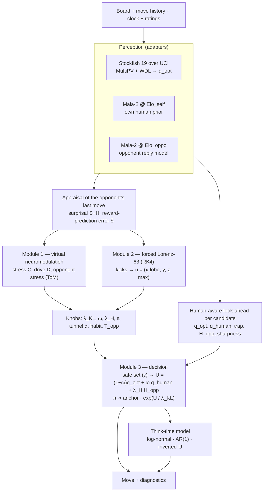

# C-AIME architecture (v0.1)

C-AIME = **C**haotic **A**ctive-**I**nference **M**CTS **E**ngine. In v0.1 the "search" is a
human-aware 2-ply look-ahead over Stockfish's truth with a closed-form piKL decision; the
chaos-modulated PUCT back-end is on the roadmap (see the end of this file).

## The core idea

Engines are weakened for humans by *capping depth* or *adding noise*, which produces
non-human blunders. CCA does the opposite: it keeps the engine's truth as a hard safety
constraint and moves the "humanity" into the **decision**:

1. **What would a human do here?** — Maia-2 at the agent's own rating: the *anchor*.
2. **What will this opponent probably answer?** — Maia-2 at the opponent's rating, flattened
   when the opponent is (estimated to be) under stress: the *opponent model*.
3. **What is objectively true?** — Stockfish 19 WDL → expected score: the *constraint*.
4. **Who am I right now?** — latent stress / drive + a strange attractor: the *temperament*.

The gap between (2) and (3) is the "key weakness between human and machine": moves after
which the human reply distribution puts mass on losing replies (**trap value**
`q_human − q_opt > 0`) while the move itself is objectively sound (within the risk budget).



## Per-move loop (`CAIMEAgent.choose`)

| Step | Code | What happens |
|---|---|---|
| 1 Perceive | `engine.evaluate(multipv=K)` | Top-K Stockfish moves with expected score from Stockfish's own WDL. |
| 2 Appraise | `_appraise` | Surprisal of the opponent's move under the reply distribution the agent predicted, minus its entropy (unexpectedness); RPE `δ = v_now − v_pred`. |
| 3 Affect | `neuro.update_on_opponent_move` | Exact discretisation of `Ċ = I − γ(C − C₀)`; bounded clock pressure `exp(−budget/T_ref)`; drive = leaky RPE integrator. |
| 4 Chaos | `LorenzOscillator.advance_ply(kick)` | RPE kicks `x`, surprise kicks `y` (quantised, capped); 40 RK4 steps. |
| 5 Candidates | `_candidate_moves` | Stockfish top-K ∪ human-prior top-M (tempered in the first 10 plies, where Maia-2 was not trained). |
| 6 Look-ahead | `_lookahead` | Opponent's human reply distribution; Stockfish value of its top replies + the refutation; unevaluated mass assumed to be the opponent's best reply (conservative). |
| 7 Knobs | `knobs_from_state` | Monotone, bounded maps from state and chaos to the decision knobs (persona gains). |
| 8 Decide | `safe_set` → `utility` → `pikl_policy` | Only moves within `ε` of the engine's best survive; closed-form KL-regularised policy anchored on the (attention-masked, habit-sharpened) prior; deterministic sampling. |
| 9 ToM | `update_opponent_model` | How surprising the agent's move is for the opponent → opponent stress → next move's `T_opp`. |
| 10 Time | `ThinkTimeModel.sample` | Human-like think time, clock-bounded. |

Cost per move: 1 root MultiPV search + ≤1 search for extra prior candidates + one restricted
MultiPV search per candidate (node-limited), and `1 + N_candidates` human-model queries
(batched on GPU for Maia-2).

## Guarantees and non-guarantees

* **Never a random blunder:** every chosen move satisfies `q_opt ≥ max q_opt − ε`, with
  `ε ≤ eps_max` of the persona (e.g. 0.15 expected score for `balanced`). Stockfish's search
  depth bounds how well `q_opt` is known.
* **Reproducible:** with a fixed seed, `threads=1` and a node limit, a game replays exactly on
  the same platform. The chaos trajectory is bit-identical across platforms; the decision path
  also uses `exp/log` (libm), so cross-platform replay can in principle differ by one move at a
  last-ulp sampling boundary.
* **Human-like ≠ unpredictable (a real tension):** anchoring on Maia-2 makes the agent's moves
  more likely under a human-move predictor. Unpredictability comes from the chaos-modulated
  `λ_KL`, regime switches of the attractor and sampling; both properties are measured
  (`mean_log_likelihood` vs policy entropy) rather than assumed.

## Layering (ports & adapters)

```
cca.core     types, deterministic RNG                      (no deps)
cca.chaos    Lorenz-63 driver                              (no deps)
cca.neuro    affect dynamics, attention, persona → knobs   (no deps)
cca.policy   distributions, piKL, QRE, safe exploitation   (no deps)
cca.timing   think-time model                              (no deps)
cca.engines  SearchEngine / HumanModel ports + adapters    (python-chess, optional maia2/torch)
cca.agent    the per-move loop                             (python-chess)
cca.uci      CCA as a UCI engine                           (python-chess)
cca.bench    virtual-clock matches + referee statistics    (python-chess)
```

## Roadmap (not in v0.1)

1. **piKL-PUCT back-end** — Maia-2 prior/value, Stockfish at leaves, `c_puct(t)` driven by the
   attractor exactly as in the owner spec. Note (Grill et al., ICML 2020): PUCT's `c_puct` acts
   as a KL-regularisation weight `λ_N = c·√N/(|A|+N)` that *shrinks* with visits, and that
   regulariser is the reverse KL(prior‖π); piKL uses forward KL(π‖τ). So "chaos on `c_puct`"
   and "chaos on `λ_KL`" are related but not identical knobs. The Maia paper also reports that
   tree search over Maia *reduces* human-likeness, so this back-end must be benchmarked, not
   assumed to help.
2. **Fitting** hand-set parameters (think time, QRE precision, affect gains) on CC0 Lichess data.
3. **Held-out human model** (Maia-1 via Lc0; Maia-3 via a separate AGPL process) to break the
   circularity of evaluating a Maia-exploiting agent against Maia.
4. **Active-Inference controller** over a small latent psych-state POMDP (pymdp) replacing the
   hand-set knob maps — only if it beats them on the pre-registered predictions in
   `docs/science.md`.
